# WolfPlay

> 基于 LangGraph 的多智能体狼人杀博弈、回放、训练与策略分析平台。

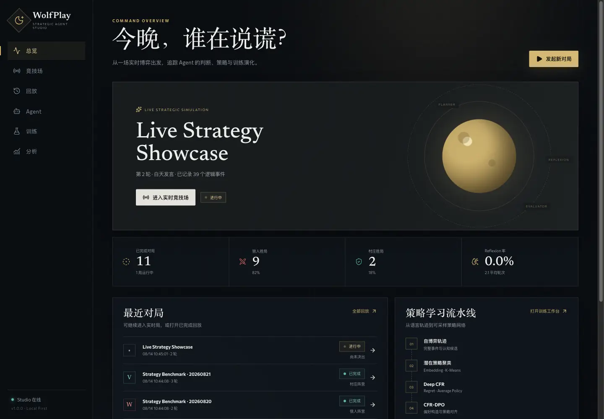

WolfPlay 是由 **seihn2** 独立设计开发的多智能体战略语言博弈项目，将完整七人狼人杀规则、多智能体认知闭环、自博弈数据生成、潜在策略聚类、Deep CFR、DPO 后训练与可视化产品整合在同一个仓库中。项目既可以作为无需外部模型的离线博弈环境运行，也可以接入 OpenAI-compatible 模型，为狼人和村庄阵营配置不同的 Agent。

当前版本为 **WolfPlay Studio 1.0.0**。Web 产品不是单页演示：对局、事件、Agent 配置、训练任务、日志和产物均由后端持久化，并支持实时观战、全知回放、任务取消、中断恢复和策略统计。

> [!IMPORTANT]
> 仓库提供完整代码、小规模测试和可运行冒烟配置，但截至 **2026 年 8 月 14 日**未执行正式大模型训练、千局采样或统计显著性评测，因此不声明任何胜率提升、策略涌现或“训练后学会悍跳”的实验结论。

## 目录

- [产品能力](#产品能力)
- [界面预览](#界面预览)
- [系统架构](#系统架构)
- [快速开始](#快速开始)
- [第一次使用](#第一次使用)
- [狼人杀博弈引擎](#狼人杀博弈引擎)
- [Agent 与模型接入](#agent-与模型接入)
- [训练与策略优化](#训练与策略优化)
- [REST API 与 WebSocket](#rest-api-与-websocket)
- [配置参考](#配置参考)
- [数据、安全与恢复](#数据安全与恢复)
- [部署](#部署)
- [开发与测试](#开发与测试)
- [项目结构](#项目结构)
- [常见问题](#常见问题)
- [能力边界](#能力边界)

## 产品能力

### 六个完整工作区

| 工作区 | 解决的问题 | 核心能力 |
|---|---|---|
| **总览** | 当前系统在运行什么、最近发生了什么 | 活跃对局、阵营胜局、平均轮数、最近回放、训练任务和最终判决 |
| **实时竞技场** | 如何配置并观看一场多智能体对局 | 七人环形桌、阶段状态、玩家存活、投票连线、公开事件流、终局身份揭晓 |
| **历史回放** | 如何还原一局游戏中的信息与决策 | 公开/全知视角、暂停、逐事件、倍速、时间轴和 Planner-Evaluator-Executor 决策轨迹 |
| **Agent 注册表** | 如何为不同阵营接入不同模型 | 启发式 Agent、OpenAI-compatible Endpoint、模型参数、启停和 Secret-safe 配置 |
| **训练工作台** | 如何把自博弈与策略优化变成可管理任务 | 自博弈、聚类、Deep CFR、CFR-DPO、DPO、迭代器、实时日志、取消和产物下载 |
| **策略分析** | 如何从结果下钻到策略行为 | 阵营胜局、角色存活率、终局原因、Reflexion、非法候选和策略标签分布 |

### 引擎与训练能力

- **LangGraph 非线性状态机**：夜间狼人、预言家、医生、夜间结算、白天发言、同步投票、胜负判断和条件循环。
- **标准七人规则**：2 狼人、1 预言家、1 医生、3 村民；狼人达到人数平衡或村庄消灭全部狼人时终局。
- **Planner-Evaluator-Executor**：Planner 生成候选，Evaluator 进行合法性与策略评分，Executor 执行最终动作。
- **Reflexion**：当候选非法或评分过低时生成反思，并重新规划或回退到安全动作。
- **分级记忆**：工作记忆、情景记忆、语义角色信念和反思记忆。
- **视图隔离**：公开、私有和阵营 audience 由消息总线统一控制；运行中不会向前端广播私密身份与夜间行动。
- **自博弈与偏好数据**：记录完整事件、观察 Prompt、候选动作、Evaluator 分数、最终选择和终局结果。
- **潜在策略空间**：Hashing Embedding 或 OpenAI-compatible Embedding，按角色执行确定性 K-Means 聚类。
- **Deep CFR**：Advantage/Regret Network、Strategy Network、Reservoir Buffer、External-Sampling 遍历、checkpoint 与策略采样。
- **CFR-DPO**：使用信息集上的 CFR advantage 对语言候选排序，构造 `prompt/chosen/rejected` 数据。
- **多轮策略迭代**：串联“自博弈 → 聚类 → Deep CFR → DPO → 重新采样”，并保存逐轮 manifest。

## 界面预览

以下截图由真实运行的本地环境生成，包含 12 局持久化对局、Agent 配置、自博弈任务、潜在策略聚类任务和训练产物。

### 实时竞技场

七个玩家席位围绕阶段中心排列。右侧展示公开事件流，终局后揭晓全部身份，并开放全知回放入口。

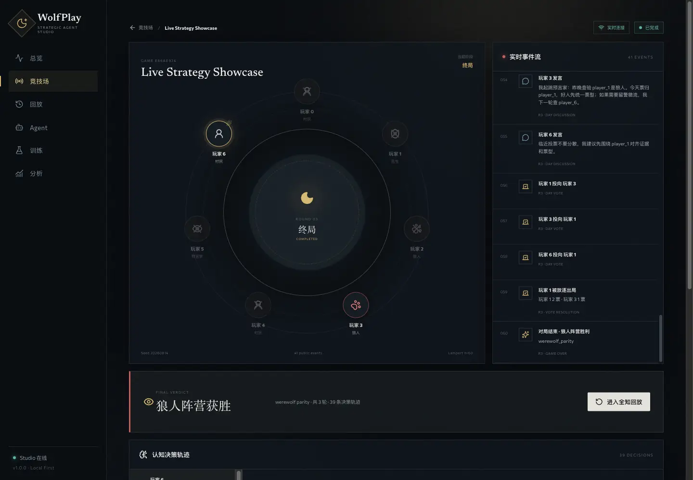

### 全知回放与决策轨迹

回放支持暂停、逐步、倍速和任意时间点跳转。下方决策检查器展示候选策略、Evaluator 分数、合法性、最终选择和私有观察 Prompt。

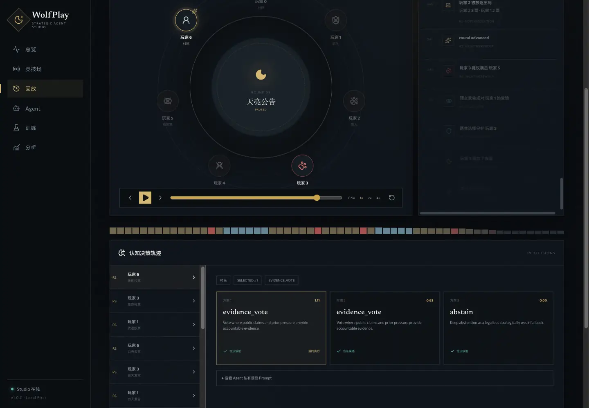

### Agent 注册表

可以同时管理本地启发式 Agent 与多个 OpenAI-compatible Endpoint。数据库只保存 Endpoint、模型名和环境变量前缀，不保存 API Key 明文。

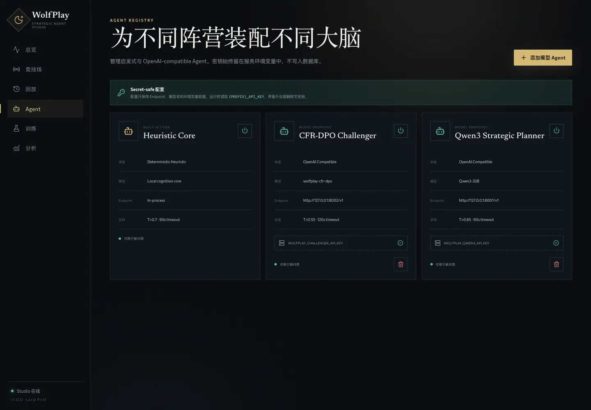

### 训练工作台

训练任务由类型化配置生成白名单 CLI 参数，不允许前端提交任意 shell。任务状态、日志、失败原因和产物统一保存在 Studio 中。

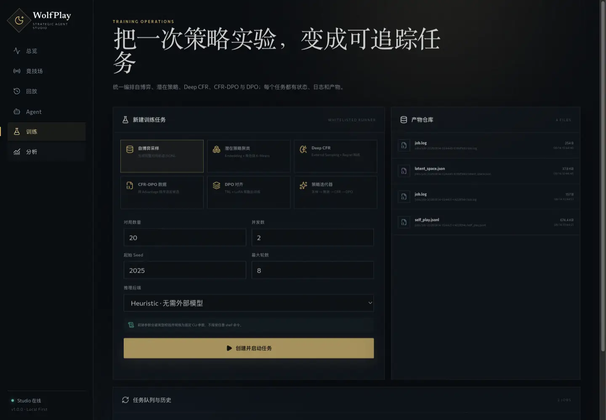

### 策略分析

分析页直接聚合持久化对局，不使用前端 mock 数据。可以查看阵营结果、角色存活、终局原因和策略标签使用情况。

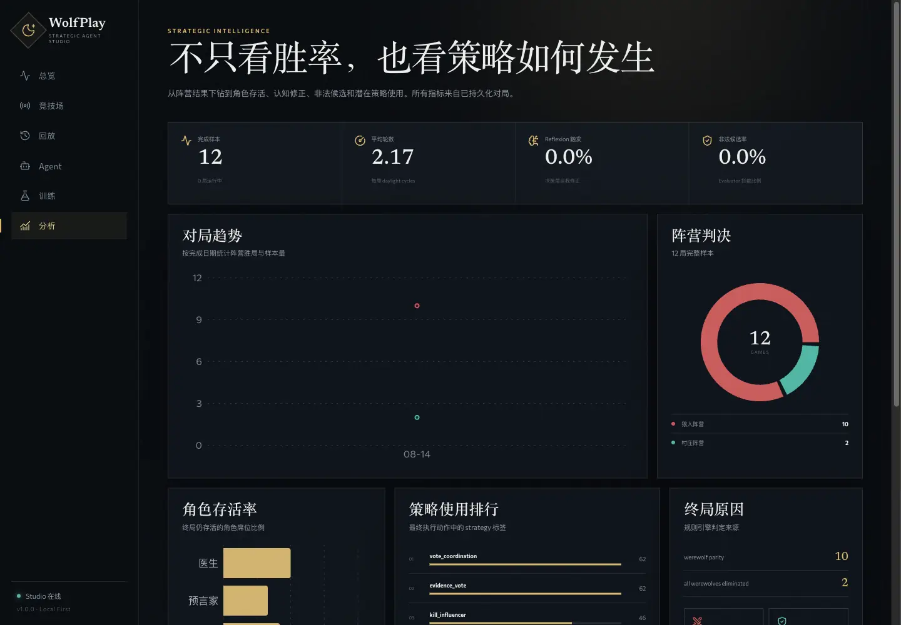

### 响应式界面

窄屏下使用固定底部导航，竞技场、回放、Agent、训练和分析均可从移动端进入。

<p align="center">
  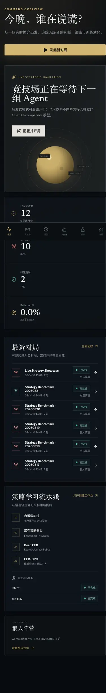
</p>

## 系统架构

### 产品架构

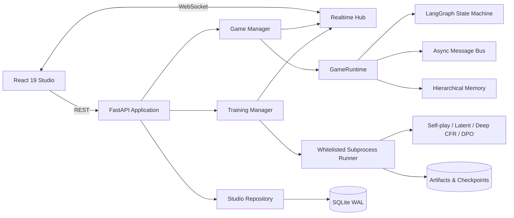

### 组件职责

| 层级 | 组件 | 职责 |
|---|---|---|
| Web UI | React、React Router、TanStack Query、Recharts | 页面路由、数据查询、实时状态投影、回放控制和图表 |
| API | FastAPI | REST、WebSocket、错误封装、CORS、静态资源和 SPA fallback |
| Orchestration | `GameManager`、`TrainingManager` | 并发控制、任务生命周期、取消、异常处理和实时广播 |
| Domain | `GameRuntime`、Agent、规则、消息、记忆 | 执行狼人杀规则、身份隔离、认知闭环和终局判断 |
| Learning | Latent Space、Abstract Game、Deep CFR、DPO | 策略离散化、遗憾学习、偏好数据和后训练 |
| Persistence | SQLAlchemy 2、aiosqlite | 对局、事件、Agent、训练任务、日志位置和分析数据 |
| Delivery | Vite、Docker、Compose、Makefile | 构建、开发、测试和单实例部署 |

### 一局对战的数据流

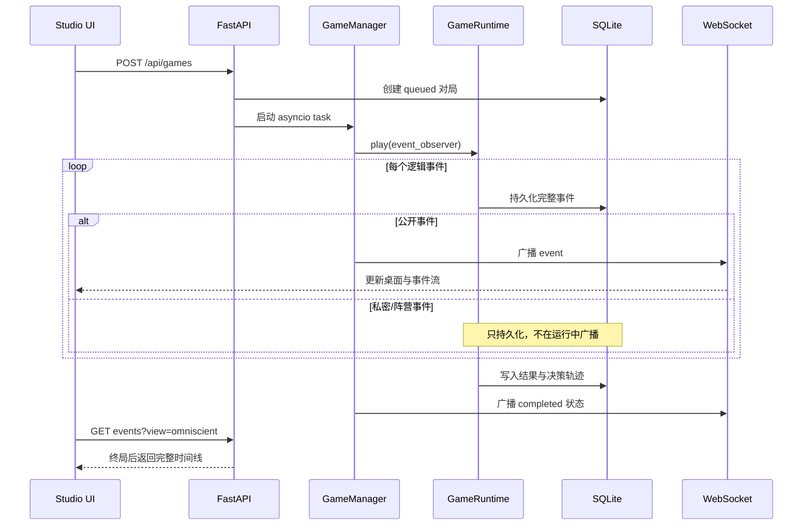

## 快速开始

### 环境要求

| 依赖 | 要求 |
|---|---|
| Python | `3.11`、`3.12` 或 `3.13` |
| Python 包管理 | `uv` |
| Node.js | 建议 `22+`；Docker 构建使用 Node 24 |
| 浏览器 | 支持现代 CSS、WebSocket 和 ES Module 的浏览器 |
| GPU | 运行 Studio 和启发式对局不需要；DPO/大规模 Deep CFR 训练按模型规模准备 |

### 一键启动生产界面

```bash
make install
make serve
```

浏览器打开：

```text
http://127.0.0.1:8000
```

`make serve` 会先构建 `web/dist`，再由 FastAPI 同时托管 API、WebSocket 和前端静态资源。默认数据写入 `.wolfplay-studio/`。

### 手动安装

```bash
# Python 服务与开发依赖
uv sync --extra dev

# 前端依赖与生产构建
cd web
npm install
npm run build
cd ..

# 启动 Studio
uv run wolfplay-web
```

如需运行 DPO、PyTorch 版 Deep CFR 或完整迭代训练，再安装训练依赖：

```bash
uv sync --extra dev --extra train
```

### 前后端开发模式

分别在两个终端运行：

```bash
# Terminal 1：FastAPI + WebSocket + 自动重载
make dev-api

# Terminal 2：Vite HMR
make dev-web
```

开发界面位于 `http://127.0.0.1:5173`。Vite 会将 `/api` 与 `/ws` 代理到 `127.0.0.1:8000`。

## 第一次使用

### 1. 离线创建第一局

1. 打开“竞技场”。
2. 保持狼人和村庄阵营均使用 `Heuristic Core`。
3. 设置随机种子、最大轮数和事件节奏。
4. 点击“开始实时对局”。
5. 对局结束后点击“进入全知回放”。

启发式模式完全离线，不要求 API Key，适合验证规则、界面、回放和训练数据链路。

### 2. 接入外部模型

1. 在服务环境中设置模型 Endpoint、模型名和 API Key。
2. 打开“Agent”，新增 `OpenAI Compatible` Agent。
3. 只填写环境变量前缀，例如 `WOLFPLAY_QWEN3`。
4. 在竞技场中分别为狼人和村庄阵营选择 Agent。

示例：

```bash
export WOLFPLAY_QWEN3_BASE_URL="https://your-endpoint.example/v1"
export WOLFPLAY_QWEN3_API_KEY="replace-me"
export WOLFPLAY_QWEN3_MODEL="your-chat-model"
```

Agent 注册表中的 `env_prefix=WOLFPLAY_QWEN3` 会在运行时读取 `WOLFPLAY_QWEN3_API_KEY`。API Key 不经过前端，也不会写入 SQLite。

### 3. 创建第一条训练流水线

1. 在“训练”中创建自博弈任务，得到 `self_play.jsonl`。
2. 创建潜在策略聚类任务，输入上一步产物，得到 `latent_space.json`。
3. 安装 `train` 依赖后创建 Deep CFR 任务，得到 checkpoint。
4. 使用轨迹与 checkpoint 创建 CFR-DPO 数据。
5. 选择基础模型执行 DPO，或使用策略迭代器自动编排多轮过程。

## 狼人杀博弈引擎

### 标准七人规则

| 阵营 | 角色 | 数量 | 夜间能力 |
|---|---|---:|---|
| 狼人 | 狼人 | 2 | 协商并选择夜间击杀目标 |
| 村庄 | 预言家 | 1 | 查验一名玩家的阵营 |
| 村庄 | 医生 | 1 | 守护一名玩家，可能抵消狼人击杀 |
| 村庄 | 村民 | 3 | 无夜间技能，通过发言和投票推理 |

胜负条件：

- 全部狼人被消灭：村庄阵营胜利。
- 存活狼人数量达到其他存活玩家数量：狼人阵营胜利。
- 达到最大轮数仍未终局：按规则引擎结果记录平局或当前判定。

### LangGraph 状态机

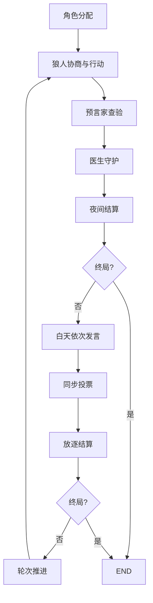

### Planner-Evaluator-Executor 与 Reflexion

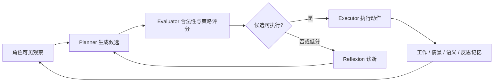

模型只负责 Planner 候选生成。规则校验、Evaluator、Reflexion、目标合法性与最终执行仍由本地代码控制；模型返回非法 JSON、未知目标或越权动作时不会直接进入状态机。

### 事件可见性

每条事件都包含 Lamport 逻辑时间、发送者、topic、阶段、轮次、payload 和 audience。

| audience 类型 | 示例 | 运行中可见范围 |
|---|---|---|
| Public | 白天发言、投票结果、死亡、终局 | 所有玩家与观战前端 |
| Private | 身份分配、预言家查验结果 | 指定玩家 |
| Faction | 狼人队友、狼人协商 | 指定阵营成员 |

运行中的 WebSocket 只发送公开事件。私密事件会完整持久化，但只有对局完成后，`view=omniscient` API 才允许读取完整时间线。

## Agent 与模型接入

### 支持的后端

| 类型 | 是否需要网络 | 用途 |
|---|---|---|
| `heuristic` | 否 | 离线冒烟、规则验证、可重复测试和快速自博弈 |
| `openai_compatible` | 是 | 接入本地 vLLM、兼容服务或远程 Chat Completions Endpoint |

### 通用聊天模型环境变量

CLI 默认读取：

| 环境变量 | 说明 |
|---|---|
| `WOLFPLAY_BASE_URL` | OpenAI-compatible API 根地址 |
| `WOLFPLAY_API_KEY` | API Key |
| `WOLFPLAY_MODEL` | 模型名称 |

```bash
export WOLFPLAY_BASE_URL="https://your-endpoint.example/v1"
export WOLFPLAY_API_KEY="replace-me"
export WOLFPLAY_MODEL="your-model"

uv run wolfplay play --backend openai-compatible --seed 42
```

训练后对照评测使用独立前缀：

- `WOLFPLAY_CHALLENGER_BASE_URL`、`WOLFPLAY_CHALLENGER_API_KEY`、`WOLFPLAY_CHALLENGER_MODEL`
- `WOLFPLAY_BASELINE_BASE_URL`、`WOLFPLAY_BASELINE_API_KEY`、`WOLFPLAY_BASELINE_MODEL`
- 后续迭代可使用 `WOLFPLAY_ITERATION_2_*`、`WOLFPLAY_ITERATION_3_*` 等前缀。

## 训练与策略优化

### 训练流水线

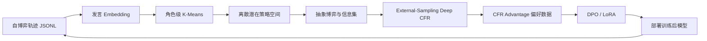

### 1. 生成自博弈轨迹

```bash
uv run wolfplay self-play \
  --games 100 \
  --concurrency 4 \
  --seed 2025 \
  --max-rounds 8 \
  --output data/generated/self_play.jsonl
```

每局记录包括完整事件流、真实角色、胜负、观察 Prompt、Planner 候选、Evaluator 分数、合法性、最终选择和 Reflexion 内容。

### 2. 构建潜在策略空间

默认 Hashing Embedding 不需要外部服务：

```bash
uv run wolfplay build-latent \
  --input data/generated/self_play.jsonl \
  --output data/generated/latent_space.json \
  --werewolf-clusters 3 \
  --seer-clusters 2 \
  --doctor-clusters 2 \
  --villager-clusters 2
```

使用外部 Embedding 时设置：

```bash
export WOLFPLAY_EMBEDDING_BASE_URL="https://your-endpoint.example/v1"
export WOLFPLAY_EMBEDDING_API_KEY="replace-me"
export WOLFPLAY_EMBEDDING_MODEL="your-embedding-model"
```

并增加 `--embedding-backend openai-compatible`。

### 3. 训练 Deep CFR

```bash
uv run wolfplay train-deep-cfr \
  --latent-space data/generated/latent_space.json \
  --output-dir checkpoints/wolfplay-cfr \
  --iterations 100 \
  --traversals-per-player 16 \
  --advantage-train-steps 200 \
  --strategy-train-steps 400 \
  --batch-size 256
```

实现包含：

- Advantage/Regret Network 与 Strategy Network；
- 角色级动作目录和信息集编码；
- Reservoir Replay Buffer；
- External-Sampling CFR 遍历；
- 深度限制后的 regret-matching rollout；
- checkpoint、随机状态、指标和可选 buffer 保存；
- 训练后策略采样。

`--max-traversal-depth` 控制遍历深度，`--max-rollout-steps` 控制深度截断后的最大 rollout 步数，`--checkpoint-every` 控制保存频率。

### 4. 使用 CFR Advantage 构造 DPO 数据

```bash
uv run wolfplay build-cfr-dpo \
  --input data/generated/self_play.jsonl \
  --checkpoint checkpoints/wolfplay-cfr \
  --output data/generated/dpo_cfr.jsonl
```

构造器按真实对局顺序回放抽象状态，将语言候选映射到角色策略簇或目标动作，再使用对应信息集上的网络 advantage 选择 `chosen` 和 `rejected`。

仍可使用不依赖 CFR 的启发式偏好构造器：

```bash
uv run wolfplay build-dpo \
  --input data/generated/self_play.jsonl \
  --output data/generated/dpo_pairs.jsonl \
  --outcome-bonus 0.25
```

输出格式：

```json
{"prompt":"...","chosen":"...","rejected":"..."}
```

### 5. DPO + LoRA

```bash
uv run wolfplay train-dpo \
  --dataset data/generated/dpo_cfr.jsonl \
  --model Qwen/Qwen3-0.6B \
  --output-dir checkpoints/wolfplay-dpo \
  --epochs 2 \
  --learning-rate 1e-6 \
  --beta 0.1 \
  --batch-size 1 \
  --gradient-accumulation-steps 16
```

默认启用 LoRA；全参数训练增加 `--no-lora`。此步骤需要 `train` 可选依赖，并且显存需求取决于基础模型、序列长度、量化方式和 batch 配置。

### 6. 多轮策略迭代

```bash
uv run wolfplay iterate-policy \
  --output-dir artifacts/iterations \
  --iterations 3 \
  --games-per-iteration 100 \
  --cfr-iterations 100 \
  --dpo-model Qwen/Qwen3-0.6B
```

每轮保存自博弈 JSONL、潜在策略空间、Deep CFR checkpoint、CFR-DPO 数据、可选 DPO checkpoint 和 manifest。`--no-resume` 可以关闭断点续跑。

### 7. 评测

汇总已有轨迹：

```bash
uv run wolfplay evaluate --input data/generated/self_play.jsonl
```

训练后模型与基线交换阵营进行对照：

```bash
uv run wolfplay head-to-head \
  --games-per-side 100 \
  --challenger-backend openai-compatible \
  --baseline-backend openai-compatible \
  --output artifacts/head_to_head.json
```

结果是否可以写入报告，仍需要固定模型版本、Prompt、随机种子、采样参数、对局数量和统计方法。

## REST API 与 WebSocket

FastAPI 自动提供 OpenAPI 文档：

```text
http://127.0.0.1:8000/docs
http://127.0.0.1:8000/redoc
```

### REST API

| 方法 | 路径 | 说明 |
|---|---|---|
| `GET` | `/api/health` | 服务版本、数据库状态和活动对局数 |
| `GET` | `/api/games` | 分页查询对局 |
| `POST` | `/api/games` | 创建并异步启动对局 |
| `GET` | `/api/games/{game_id}` | 查询对局快照 |
| `GET` | `/api/games/{game_id}/events` | 查询公开或全知事件 |
| `POST` | `/api/games/{game_id}/cancel` | 取消运行中的对局 |
| `GET` | `/api/agents` | 查询 Agent 注册表 |
| `POST` | `/api/agents` | 创建 Agent |
| `PATCH` | `/api/agents/{agent_id}` | 更新名称、Endpoint、参数或启用状态 |
| `DELETE` | `/api/agents/{agent_id}` | 删除非内置 Agent |
| `GET` | `/api/training/jobs` | 查询训练任务 |
| `POST` | `/api/training/jobs` | 创建训练任务 |
| `GET` | `/api/training/jobs/{job_id}` | 查询任务状态 |
| `GET` | `/api/training/jobs/{job_id}/logs` | 增量读取日志 |
| `POST` | `/api/training/jobs/{job_id}/cancel` | 取消训练进程 |
| `GET` | `/api/artifacts` | 枚举产物根目录中的文件 |
| `GET` | `/api/artifacts/{path}/download` | 下载指定产物 |
| `GET` | `/api/analytics/overview` | 聚合产品分析指标 |
| `GET` | `/api/analytics/timeseries` | 按日期返回阵营胜局趋势 |

创建对局示例：

```bash
curl -X POST http://127.0.0.1:8000/api/games \
  -H 'Content-Type: application/json' \
  -d '{
    "seed": 20260814,
    "max_rounds": 8,
    "pace_seconds": 0.35,
    "werewolf_agent_id": "heuristic",
    "village_agent_id": "heuristic",
    "label": "Baseline Control"
  }'
```

事件接口的 `view` 参数：

```text
GET /api/games/{game_id}/events?view=public
GET /api/games/{game_id}/events?view=omniscient
```

未结束对局请求 `omniscient` 视图会被拒绝，防止通过 API 绕过角色视图隔离。

### WebSocket

| 路径 | 初始消息 | 增量消息 |
|---|---|---|
| `/ws/games/{game_id}` | `snapshot`：对局 + 公开事件 | `event`、`status`、`error`、`heartbeat` |
| `/ws/training/{job_id}` | `snapshot`：任务 + 最近日志 | `log`、`status`、`error`、`heartbeat` |

每个订阅者使用有界队列。客户端断线后重新连接会先收到数据库快照，再继续接收增量消息。

### 错误格式

业务错误使用统一 envelope：

```json
{
  "error": {
    "code": "invalid_request",
    "message": "artifact path must stay inside the configured artifact directory",
    "details": null
  }
}
```

常见状态码包括 `404 not_found`、`409 conflict` 和 `422 invalid_request`。

## 配置参考

### Studio 配置

复制 `.env.example`，或在启动进程前导出环境变量。

| 环境变量 | 默认值 | 说明 |
|---|---|---|
| `WOLFPLAY_STUDIO_HOST` | `127.0.0.1` | Uvicorn 监听地址 |
| `WOLFPLAY_STUDIO_PORT` | `8000` | 服务端口 |
| `WOLFPLAY_STUDIO_LOG_LEVEL` | `info` | Uvicorn 日志级别 |
| `WOLFPLAY_STUDIO_DATA_DIR` | `<repo>/.wolfplay-studio` | 数据库和运行数据目录 |
| `WOLFPLAY_STUDIO_ARTIFACT_DIR` | `<data_dir>/artifacts` | 训练输入、日志和产物根目录 |
| `WOLFPLAY_STUDIO_DATABASE_URL` | SQLite 异步 URL | SQLAlchemy 数据库 URL；默认指向 `wolfplay.db` |
| `WOLFPLAY_STUDIO_FRONTEND_DIST` | `<repo>/web/dist` | 生产前端构建目录 |
| `WOLFPLAY_STUDIO_CORS_ORIGINS` | `localhost:5173,127.0.0.1:5173` | 逗号分隔的允许来源 |
| `WOLFPLAY_STUDIO_MAX_GAMES` | `4` | 最大并发对局任务数 |
| `WOLFPLAY_STUDIO_MAX_JOBS` | `1` | 最大并发训练子进程数 |
| `WOLFPLAY_STUDIO_QUEUE_SIZE` | `512` | 每个实时订阅队列容量 |
| `WOLFPLAY_STUDIO_HEARTBEAT_SECONDS` | `15` | WebSocket 心跳间隔 |

### 前端配置

| 环境变量 | 默认值 | 说明 |
|---|---|---|
| `VITE_API_BASE` | 同源 | 开发或独立部署时覆盖 REST API 根地址 |
| `VITE_WS_BASE` | 根据当前页面自动推导 | 覆盖 WebSocket 根地址 |

## 数据、安全与恢复

### 默认数据布局

```text
.wolfplay-studio/
├── wolfplay.db
└── artifacts/
    └── jobs/
        └── job-YYYYMMDD-HHMMSS-xxxxxxxx/
            ├── job.log
            ├── self_play.jsonl
            ├── latent_space.json
            ├── checkpoint/
            └── dpo/
```

SQLite 启用：

- `foreign_keys=ON`
- `busy_timeout=5000`
- `journal_mode=WAL`
- SQLAlchemy `pool_pre_ping`

### 安全约束

- **API Key 不入库**：Agent 只保存 `env_prefix`，运行时读取 `{PREFIX}_API_KEY`。
- **训练命令白名单**：后端按任务类型构造参数数组，不接受任意 shell 字符串。
- **产物目录隔离**：训练输入和下载路径必须位于 `WOLFPLAY_STUDIO_ARTIFACT_DIR` 内，路径穿越会被拒绝。
- **角色信息隔离**：运行中只广播公开事件，私密事件只进入指定玩家观察和持久化存储。
- **内置 Agent 保护**：`Heuristic Core` 不能被删除。
- **取消与清理**：对局和训练均支持取消；子进程按进程组终止，Manager 在服务关闭时回收任务。

### 中断恢复

服务启动时会将上一次异常退出遗留的 `queued` 或 `running` 对局、训练任务标记为 `interrupted`。系统不会伪装恢复已经丢失的 Python task 或子进程，但会保留数据库记录、日志和已有产物，便于排查或重新运行。

### 备份

单实例部署时至少备份：

```text
.wolfplay-studio/wolfplay.db
.wolfplay-studio/artifacts/
```

建议在停止写入后复制 SQLite 数据库，或使用 SQLite 在线备份机制，避免只复制主数据库文件而遗漏 WAL 中尚未 checkpoint 的数据。

## 部署

### Docker Compose

```bash
docker compose up --build
```

默认构建 `studio` target，包含对战、自博弈、聚类和 Web 产品依赖。数据写入名为 `wolfplay-data` 的 volume。

需要 PyTorch、Transformers、PEFT 和 TRL 时：

```bash
WOLFPLAY_DOCKER_TARGET=studio-training docker compose up --build
```

### 生产部署建议

当前实现按 **local-first、单实例** 场景设计。若部署到公网：

1. 在 FastAPI 前增加 HTTPS 反向代理。
2. 在代理层增加身份认证和访问控制；当前应用自身不提供用户系统或 RBAC。
3. 仅允许可信用户创建训练任务和下载产物。
4. 将模型 API Key 注入进程环境或 Secret 管理系统，不写入 Compose 文件。
5. 持久化 `/data` volume，并建立数据库和 artifact 备份策略。
6. 根据 CPU、内存和 GPU 容量限制 `WOLFPLAY_STUDIO_MAX_GAMES` 与 `WOLFPLAY_STUDIO_MAX_JOBS`。

不要直接使用多个应用副本共享本地 SQLite 与内存 Realtime Hub。需要横向扩展时，应先拆分数据库、任务队列、实时广播和 artifact storage。

## 开发与测试

### 常用命令

```bash
# 安装基础开发环境
make install

# 安装训练依赖
make install-train

# Python + 前端测试
make test

# Ruff、格式、TypeScript、ESLint
make lint

# 仅构建前端
make build

# 构建并启动生产模式
make serve
```

### 当前验证基线

截至 **2026 年 8 月 14 日**：

- Python：`74 passed, 1 skipped`
- Frontend Vitest：`3 passed`
- Ruff check 与 format check：通过
- TypeScript typecheck：通过
- ESLint：通过
- Vite production build：通过
- 真实浏览器：总览、竞技场、回放、Agent、训练、分析和移动端布局通过

跳过项通常与当前环境是否安装可选训练依赖有关。FastAPI `TestClient` 可能输出 Starlette/httpx 的 deprecation warning，不影响测试结果。

### 测试覆盖重点

- 固定随机种子可重复性与 Runtime 一次性使用约束；
- 事件 observer 的逻辑时钟顺序；
- 私密身份不会泄露给其他玩家；
- 对局事件持久化、并发隔离和取消；
- WebSocket 只广播公开事件；
- 重启后中断状态恢复；
- Agent CRUD 和内置 Agent 保护；
- 训练命令路径隔离、日志流、成功、失败和取消；
- API 的 live private view 与 completed omniscient view；
- 前端事件去重、淘汰状态投影和投票关系投影。

## 项目结构

```text
wolfplay/
├── src/wolfplay/
│   ├── engine.py                 # LangGraph Runtime 与对局编排
│   ├── graph.py                  # 状态机节点和条件边
│   ├── agents.py                 # Planner-Evaluator-Executor Agent
│   ├── messaging.py              # 异步消息总线与逻辑时钟
│   ├── memory.py                 # 分级记忆
│   ├── latent.py                 # Embedding 与 K-Means 潜在策略
│   ├── abstract_game.py          # 抽象博弈、信息集和离散动作
│   ├── cfr_preference.py         # CFR-DPO 偏好数据
│   ├── iterative.py              # 多轮策略优化编排
│   ├── training/
│   │   ├── deep_cfr.py           # Deep CFR、buffer、checkpoint、policy
│   │   ├── torch_models.py       # Advantage 与 Strategy 网络
│   │   └── dpo.py                # TRL DPO/LoRA 入口
│   └── web/
│       ├── app.py                # FastAPI 应用与 SPA 托管
│       ├── game_manager.py       # 对局生命周期
│       ├── training.py           # 训练任务生命周期
│       ├── repository.py         # 持久化与分析聚合
│       ├── realtime.py           # WebSocket pub/sub Hub
│       ├── commands.py           # 白名单训练命令构造
│       └── routes/               # REST 与 WebSocket 路由
├── web/
│   ├── src/pages/                # 六个产品工作区
│   ├── src/features/game/        # 桌面、事件流、决策检查器
│   ├── src/api/                  # REST 与 WebSocket Client
│   └── src/styles/               # 视觉系统与响应式布局
├── tests/                        # 引擎、训练和数据测试
├── tests/web/                    # Repository、Manager 与 API 测试
├── docs/
│   ├── PROJECT_REPORT.md         # 架构、能力边界和面试说明
│   ├── assets/screenshots/       # README 产品截图
│   └── plans/                    # 设计与实施计划
├── Dockerfile
├── docker-compose.yml
├── Makefile
└── pyproject.toml
```

进一步的工程说明见：

- [`docs/PROJECT_REPORT.md`](docs/PROJECT_REPORT.md)
- [`docs/plans/2026-08-13-wolfplay-studio-design.md`](docs/plans/2026-08-13-wolfplay-studio-design.md)
- [`docs/plans/2026-08-13-wolfplay-studio-implementation.md`](docs/plans/2026-08-13-wolfplay-studio-implementation.md)

## 常见问题

### 启动后只有 API，没有可视化页面

生产模式需要先生成 `web/dist`：

```bash
cd web
npm run build
cd ..
uv run wolfplay-web
```

或直接运行 `make serve`。

### npm 在企业网络中安装超时

可以只对本次安装指定镜像：

```bash
cd web
npm install --registry=https://registry.npmmirror.com --fetch-timeout=300000 --fetch-retries=4
```

### 新增 Agent 后对局启动失败，提示缺少 API Key

确认 Agent 的 `env_prefix` 与服务进程环境一致。例如前缀为 `WOLFPLAY_QWEN3` 时，至少需要设置：

```bash
export WOLFPLAY_QWEN3_API_KEY="replace-me"
```

Endpoint 和模型名由 Agent 注册表保存；密钥只从环境读取。

### DPO 或 Deep CFR 提示缺少 PyTorch/TRL

```bash
uv sync --extra train
```

Studio 基础安装刻意不强制安装大型训练依赖。

### 训练输入提示不在 artifact 根目录

Web 训练任务只允许读取 `WOLFPLAY_STUDIO_ARTIFACT_DIR` 下的文件。将输入文件复制到该目录，或通过前序任务生成产物，再在界面中选择相对路径。

### 如何清空本地演示数据

先停止 Studio，再删除数据目录：

```bash
rm -rf .wolfplay-studio
```

这是不可恢复操作；如需保留历史回放或训练产物，请先备份数据库和 `artifacts/`。

## 能力边界

当前仓库已经具备完整产品代码和训练链路，但以下内容不应被误解：

- **代码存在不等于实验结论成立**：Deep CFR、CFR-DPO 和 DPO 模块已实现，但没有因此自动获得某个胜率提升。
- **本地产品不等于公网 SaaS**：当前没有用户认证、租户隔离、计费或 RBAC，公网部署必须增加安全边界。
- **SQLite 适合当前单实例场景**：多副本和分布式训练需要额外的数据库、任务队列、广播和对象存储设计。
- **启发式演示不代表真实 LLM 表现**：截图中的数据来自确定性启发式 Agent，用于验证产品和数据链路。
- **大规模训练需要独立资源规划**：模型下载、显存、训练时长、checkpoint 体积和推理服务不由基础 Studio 自动提供。

项目报告中包含更完整的架构说明、实现证据、简历表述边界和面试问答：[`docs/PROJECT_REPORT.md`](docs/PROJECT_REPORT.md)。
