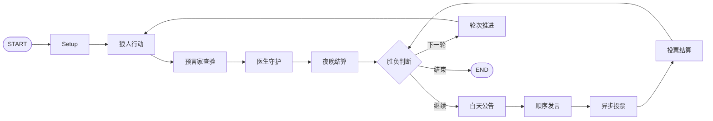

# WolfPlay

基于 LangGraph 的多智能体狼人杀对战框架，包含完整的七人局游戏循环、角色视图隔离、Planner-Evaluator-Executor 认知闭环、Reflexion、分级记忆、自博弈轨迹生成和 TRL DPO 后训练入口。

代码参考 ICML 2025 论文 [Learning Strategic Language Agents in the Werewolf Game with Iterative Latent Space Policy Optimization](https://arxiv.org/abs/2502.04686)。本仓库实现的是可运行工程版，不宣称复现论文的大规模 Deep CFR、千局采样或任何胜率提升结果。

完整的架构说明、论文差距、验收标准、真实简历表述和面试问答见 [`docs/PROJECT_REPORT.md`](docs/PROJECT_REPORT.md)。

## 已实现

- **LangGraph 状态机**：夜间狼人、预言家、医生、结算、白天发言、同步投票、胜负判断和条件边循环。
- **七人论文规则**：2 狼人、1 预言家、1 医生、3 村民；狼人达到人数平衡即获胜。
- **认知闭环**：Planner 生成多个候选，Evaluator 评分，Executor 执行，低分或非法动作进入 Reflexion。
- **高级策略候选**：狼人候选策略包含隐藏身份、带票、悍跳预言家和伪造验人信息。
- **分级记忆**：工作记忆、情景记忆、语义角色信念和反思记忆。
- **异步消息总线**：`asyncio.Queue`、Lamport 逻辑时钟、公开/私有/阵营 audience 隔离。
- **离线与模型双后端**：默认启发式 Agent 无需 API；也可连接任意 OpenAI-compatible 聊天接口。
- **训练数据链路**：游戏轨迹 JSONL → outcome-aware 偏好对 → `prompt/chosen/rejected` DPO JSONL。
- **DPO/LoRA**：Hugging Face TRL `DPOTrainer` 训练入口，不需要修改对战代码。
- **双阵营对照评测**：challenger 与 baseline 分别控制狼人/村民阵营并交换阵营评测。

## 架构



每个 Agent 只从 `AsyncMessageBus.events_for(player_id)` 获得可见事件。预言家查验、角色分配和狼人队友信息使用私有 audience，不会出现在其他玩家的观察或记忆中。

## 安装

推荐 Python 3.11：

```bash
uv sync --extra dev
```

训练时再安装 PyTorch/TRL：

```bash
uv sync --extra train
```

## 运行完整对局

默认启发式 Agent，不需要外部模型：

```bash
uv run wolfplay play --seed 42 --max-rounds 8 \
  --output artifacts/demo_game.json
```

也可以使用根目录入口：

```bash
uv run python main.py play --seed 42
```

### 接入聊天模型

```bash
cp .env.example .env
export WOLFPLAY_BASE_URL="https://your-endpoint.example/v1"
export WOLFPLAY_API_KEY="..."
export WOLFPLAY_MODEL="your-model"

uv run wolfplay play --backend openai-compatible
```

模型只负责 Planner 生成候选；Evaluator、规则校验和 Reflexion 仍在本地执行，因此模型输出非法 JSON 或非法动作时会自动回退。

## 自博弈与 DPO

### 1. 生成轨迹

```bash
uv run wolfplay self-play \
  --games 100 \
  --concurrency 4 \
  --seed 2025 \
  --max-rounds 8 \
  --output data/generated/self_play.jsonl
```

每条游戏记录包含：

- 完整事件流和逻辑时间；
- 每名玩家的真实角色和最终胜负；
- 每次决策的 observation prompt；
- Planner 候选动作；
- Evaluator 分数与合法性；
- 最终选择和 Reflexion 内容。

### 2. 构造 DPO 偏好数据

```bash
uv run wolfplay build-dpo \
  --input data/generated/self_play.jsonl \
  --output data/generated/dpo_pairs.jsonl \
  --outcome-bonus 0.25
```

如只保留胜方轨迹：

```bash
uv run wolfplay build-dpo \
  --input data/generated/self_play.jsonl \
  --output data/generated/dpo_winners.jsonl \
  --winning-only
```

输出格式可直接交给 TRL：

```json
{"prompt":"...","chosen":"...","rejected":"..."}
```

### 3. DPO + LoRA 训练

```bash
uv run wolfplay train-dpo \
  --dataset data/generated/dpo_pairs.jsonl \
  --model Qwen/Qwen3-0.6B \
  --output-dir checkpoints/wolfplay-dpo \
  --epochs 2 \
  --learning-rate 1e-6 \
  --beta 0.1 \
  --batch-size 1 \
  --gradient-accumulation-steps 16
```

默认启用 LoRA。全参数训练增加 `--no-lora`。

### 4. 汇总胜率

```bash
uv run wolfplay evaluate --input data/generated/self_play.jsonl
```

该命令只统计真实运行产生的数据。简历中的“胜率提升 23%”必须在固定基线、随机种子、模型版本和足够局数下实际测量后才能保留。

### 5. 训练后模型对基线评测

分别配置 `WOLFPLAY_CHALLENGER_*` 与 `WOLFPLAY_BASELINE_*` 后运行：

```bash
uv run wolfplay head-to-head \
  --games-per-side 100 \
  --challenger-backend openai-compatible \
  --baseline-backend openai-compatible \
  --output artifacts/head_to_head.json
```

该命令会让双方交换阵营，并分别输出 challenger 的狼人侧、村民侧和总体胜率。

## 目录

```text
src/wolfplay/
├── bus.py             # 异步消息总线和 Lamport 时钟
├── cognition.py       # Planner-Evaluator-Executor + Reflexion
├── engine.py          # LangGraph 游戏状态机
├── evaluation.py      # challenger/baseline 双阵营评测
├── llm.py             # OpenAI-compatible 异步模型后端
├── memory.py          # 分级记忆与角色信念
├── models.py          # 状态、事件、动作和轨迹模型
├── preference.py      # 自博弈轨迹转 DPO 偏好对
├── self_play.py       # 并发自博弈、原子输出与统计
├── cli.py             # 对战、数据、评估和训练命令
└── training/dpo.py    # TRL DPO/LoRA 训练入口
```

原仓库的旧版脚本仍保留在根目录作为参考，新实现统一从 `src/wolfplay/` 启动。

## 测试

```bash
uv run pytest
uv run ruff check src tests main.py
```

## 安全说明

上游仓库历史中曾提交多个疑似真实 API Key。当前工作树已移除这些值，但 Git 历史中的凭据必须由持有者在服务商后台立即吊销；仅删除当前文件不能使旧 Key 失效。
