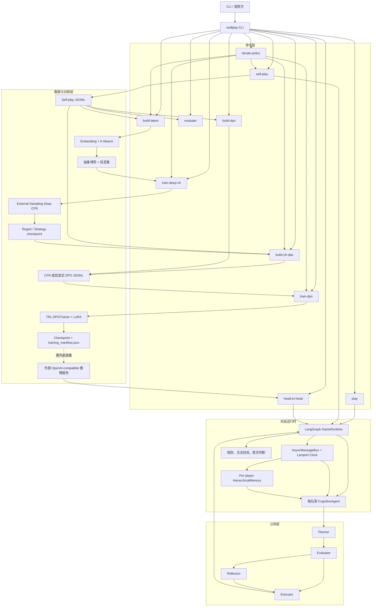
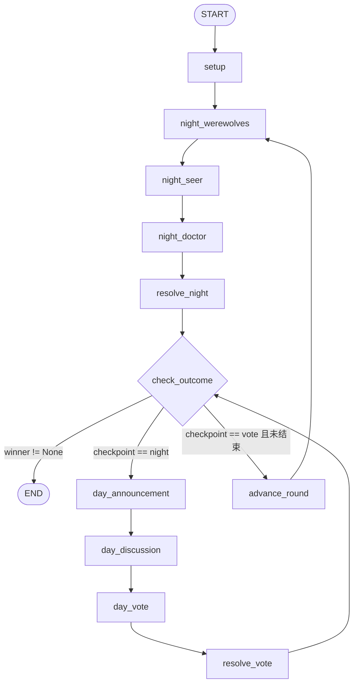
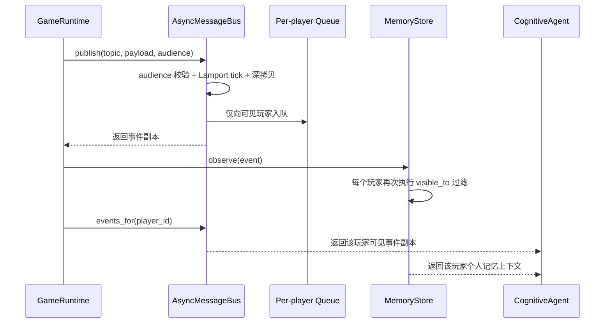
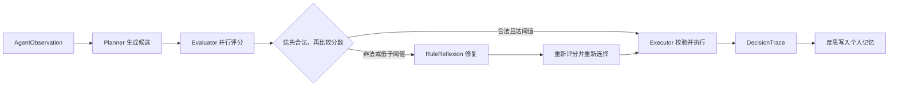

# WolfPlay：基于 LangGraph 的多智能体狼人杀博弈与 Deep CFR/DPO 后训练框架

> **项目状态**：可运行的工程原型；对战、自博弈、潜在策略聚类、抽象博弈、Deep CFR、CFR 偏好数据、DPO/LoRA 训练入口、多轮编排和双阵营对照评测代码已具备。当前仓库**未执行正式模型训练与性能实验**，因此不声明任何胜率提升或策略涌现结果。

## 1. 项目概述

WolfPlay 是一个面向战略语言 Agent 研究与工程验证的七人狼人杀框架。系统使用 LangGraph 编排夜晚行动、白天讨论、同步投票和胜负循环；每个玩家通过独立观察、私有事件和分级记忆进行决策；认知模块采用 Planner-Evaluator-Executor 流程，并通过规则型 Reflexion 修复非法或低质量动作。

项目同时提供一条完整但尚未实跑模型训练的后训练链路：

1. 批量自博弈生成带决策轨迹的 JSONL；
2. 将候选动作、启发式评分和终局胜负转换为 DPO 偏好对；
3. 使用 TRL `DPOTrainer` 执行 DPO，可选 LoRA；
4. 将训练后模型部署为 OpenAI-compatible 接口；
5. 通过 `head-to-head` 让 challenger 与 baseline 分别控制狼人阵营和村民阵营，再互换阵营评测。

### 1.1 当前能力边界

| 维度 | 当前状态 | 结论 |
|---|---|---|
| 七人狼人杀完整对局 | 已实现 | 支持 2 狼人、1 预言家、1 医生、3 村民 |
| LangGraph 条件状态机 | 已实现 | 胜负检查后按检查点路由到白天、下一轮或结束 |
| 角色视图隔离 | 已实现 | 私有 topic 强制显式 audience，每个 Agent 只接收可见事件 |
| Planner-Evaluator-Executor | 已实现 | 支持启发式 Planner 与 OpenAI-compatible Planner |
| Reflexion | 已实现工程版 | 规则型单步修复，不等同于开放式自我反思训练 |
| 分级记忆 | 已实现单局版 | 工作、情景、语义信念、反思四层；不跨对局持久化 |
| 自博弈轨迹 | 已实现 | 支持并发、固定种子、原子写入 JSONL |
| DPO 数据构造 | 已实现 | 使用合法性、启发式评分和终局奖励调整生成偏好对 |
| DPO/LoRA 训练入口 | 已实现代码 | 未在本项目中执行真实模型训练 |
| challenger/baseline 对照评测 | 已实现 | 支持两阵营互换，输出分阵营与总体统计 |
| 发言 Embedding 与 K-Means | 已实现 | 支持离线 Hashing 与 OpenAI-compatible Embedding，按角色聚类并持久化 |
| 抽象扩展式博弈 | 已实现 | 包含离散策略空间、信息集向量、私有知识、机会节点和奖励累计 |
| External-Sampling Deep CFR | 已实现代码 | Advantage/Strategy 网络、Reservoir Buffer、rollout、checkpoint 和策略采样齐全 |
| CFR 驱动 DPO 偏好 | 已实现 | 可回放语言轨迹并按网络 advantage 选择 chosen/rejected |
| 多轮策略优化编排 | 已实现 | 串联采样、聚类、Deep CFR、DPO 和下一轮重新采样，支持断点续跑 |
| “胜率提升 23%” | 无证据 | 不应出现在当前简历、报告或对外介绍中 |

---

## 2. 项目背景与独立设计

### 2.1 项目定位

WolfPlay 是 seihn2 独立设计开发的多智能体战略语言博弈项目。项目目标不是只提供一个能够聊天的狼人杀 Demo，而是把环境状态、信息隔离、语言决策、博弈求解、偏好数据、后训练和评测拆成可测试、可替换的工程模块。

### 2.2 代码演进

仓库 Git remote 指向 [seihn2/werewolf](https://github.com/seihn2/werewolf)。根目录保留项目早期的多模型狼人杀脚本，当前主路径为独立的 `src/wolfplay/` Python 包，并统一通过 `wolfplay` CLI 启动。

| 代码区域 | 定位 | 是否为当前主路径 |
|---|---|---|
| 根目录早期脚本 | 项目早期的控制器、玩家、记忆和模型管理实现 | 否，仅作为历史版本保留 |
| `src/wolfplay/` | LangGraph、认知闭环、潜在策略、Deep CFR、DPO 和评测 | 是 |
| `main.py` | 将根目录入口转发到 `wolfplay.cli:main` | 是 |

### 2.3 技术目标与能力边界

项目围绕三条主线组织：

1. **可信对战环境**：标准七人配置、角色私有视图、Lamport 时钟、异步消息总线和确定性规则校验；
2. **语言与离散策略联动**：Planner 生成候选，Embedding 与 K-Means 将发言映射为角色潜在策略，抽象博弈负责有限动作求解；
3. **策略学习闭环**：External-Sampling Deep CFR 产生 advantage，语言轨迹回放器构造 DPO 偏好，多轮编排器负责重新采样和 artifact 管理。

当前代码已经覆盖完整模块和小规模冒烟路径，但没有执行正式训练、千局采样或统计显著性评测。因此可以说明“算法代码与运行入口已实现”，不能说明“模型性能已经提升”。

---

## 3. 核心能力

| 能力 | 实现说明 | 主要代码 |
|---|---|---|
| 非线性游戏编排 | LangGraph `StateGraph` 注册 11 个节点，通过条件边控制循环与终止 | `src/wolfplay/engine.py` |
| 七人规则环境 | 随机分配固定角色集合，支持狼人协作、预言家查验、医生守护、白天讨论和投票 | `src/wolfplay/engine.py` |
| 多 Agent 独立决策 | 每位玩家拥有独立 `CognitiveAgent`，可按阵营注入不同模型后端 | `src/wolfplay/engine.py` |
| 角色视图隔离 | 公共、个人和狼人阵营事件通过 audience 分发，私有 topic 无 audience 时直接拒绝 | `src/wolfplay/bus.py` |
| 逻辑时钟 | Lamport 时钟为事件提供单调逻辑序，发布锁保证并发发布与队列顺序一致 | `src/wolfplay/bus.py` |
| 分级记忆 | 工作、情景、语义角色信念、反思四层，支持有界存储和按查询召回 | `src/wolfplay/memory.py` |
| 认知闭环 | Planner 生成候选，Evaluator 并行评分，Executor 校验执行，Reflexion 修复 | `src/wolfplay/cognition.py` |
| 高阶策略模板 | 狼人启发式候选包含隐藏身份、伪装预言家、伪造验人和组织票型 | `src/wolfplay/cognition.py` |
| 双推理后端 | 默认启发式模式可离线运行；模型模式调用 OpenAI-compatible `/chat/completions` | `src/wolfplay/llm.py` |
| 自博弈数据生产 | 并发运行多局、固定种子序列、原子写入完整训练轨迹 | `src/wolfplay/self_play.py` |
| 潜在策略构造 | Hashing/OpenAI-compatible Embedding、按角色 K-Means、代表文本和 JSON 持久化 | `src/wolfplay/latent.py` |
| 抽象扩展式博弈 | 离散发言动作、夜间/投票目标、私有信息集、机会节点和奖励累计 | `src/wolfplay/abstract_game.py` |
| Deep CFR | Advantage/Strategy 网络、Reservoir Buffer、External-Sampling、rollout 与 checkpoint | `src/wolfplay/training/deep_cfr.py` |
| CFR 偏好构造 | 回放语言轨迹，将候选映射到抽象动作并按网络 advantage 排序 | `src/wolfplay/cfr_preference.py` |
| 多轮策略编排 | 自动串联采样、聚类、CFR、DPO 数据、可选训练和下一轮后端交接 | `src/wolfplay/iterative.py` |
| 启发式 DPO 偏好 | 对候选做合法性优先和分数排序，并用终局结果调整最终执行候选 | `src/wolfplay/preference.py` |
| 可追溯训练入口 | 数据校验、数据 SHA-256、训练 manifest、固定 seed、LoRA/全参 DPO | `src/wolfplay/training/dpo.py` |
| 训练后对照评测 | challenger/baseline 分别控制两阵营并交换阵营，输出明细与汇总 | `src/wolfplay/evaluation.py` |

---

## 4. 整体架构



### 4.1 关键设计取舍

- **游戏真值集中管理，Agent 只接收投影视图**：`GameRuntime` 持有完整状态，但传入 Agent 的是 `AgentObservation`，其中只包含自己的角色、允许知道的队友、公开玩家信息、合法目标、可见事件和个人记忆。
- **规则与语言模型解耦**：LLM 只负责提出候选；动作合法性、策略评分、胜负和状态变化均由本地代码控制。
- **对战依赖轻量，训练依赖可选**：普通对战不需要安装 PyTorch、Transformers、Datasets、PEFT 和 TRL。
- **训练后模型通过可替换后端接回环境**：CLI 支持逐轮 OpenAI-compatible 服务配置，库级 `backend_factory` 可以接入自定义本地 checkpoint 加载器。

---

## 5. LangGraph 节点与状态流转

### 5.1 节点图



### 5.2 节点职责

| 节点 | 处理内容 | 并发/顺序特征 | 主要输出 |
|---|---|---|---|
| `setup` | 发布开局事件、逐人私发角色、向狼人私发队友列表 | 顺序发布 | 切换到狼人夜间阶段 |
| `night_werewolves` | 存活狼人依次提出目标；后行动狼人给出最终目标 | 顺序决策 | `werewolf_kill` |
| `night_seer` | 存活预言家选择查验目标并私收结果 | 单 Agent | `seer_check`、`seer_result` |
| `night_doctor` | 存活医生选择保护目标 | 单 Agent | `doctor_protect` |
| `resolve_night` | 比较击杀与保护目标，更新存活状态 | 规则节点 | 夜间死者或平安夜 |
| `check_outcome` | 判断狼人全灭、狼人人数平衡或达到最大轮数 | 条件路由节点 | 胜者、终止原因或继续路由 |
| `day_announcement` | 公布夜间结果和存活玩家 | 广播 | 切换到讨论阶段 |
| `day_discussion` | 存活玩家按 ID 顺序各发言一次 | 顺序决策，后发言者可看到前文 | 公开发言事件 |
| `day_vote` | 为所有存活玩家先构造观察，再并行决策 | `asyncio.gather` | 每人投票动作 |
| `resolve_vote` | 统计票数；平票时使用带 seed 的随机数选择出局者 | 规则节点 | 白天出局者与公开票型 |
| `advance_round` | 清空当轮临时动作，轮数加一 | 状态维护 | 返回下一夜 |

### 5.3 终局规则

- 所有狼人被淘汰：村民阵营胜利；
- 存活狼人数大于等于其他存活玩家数：狼人阵营胜利；
- 在完成白天投票后达到 `max_rounds`：平局；
- `GameRuntime` 实例只允许执行一局，防止残留消息和记忆污染下一局。

---

## 6. 消息总线与角色视图隔离

### 6.1 数据流



### 6.2 可见性规则

`audience=None` 表示公开事件；非空 audience 表示仅指定玩家可见。消息总线对以下私有 topic 强制要求显式 audience：

| 私有 topic | 可见对象 |
|---|---|
| `role_assignment` | 对应玩家本人 |
| `werewolf_team` | 狼人阵营 |
| `werewolf_proposal` | 存活狼人 |
| `seer_result` | 预言家本人 |
| `doctor_choice` | 医生本人 |

典型公开事件包括 `game_started`、`night_result`、`day_started`、`speech`、`vote_cast`、`vote_result`、`round_advanced` 和 `game_over`。

### 6.3 隔离保证

- 私有 topic 未指定 audience 时，`publish` 直接抛错；
- audience 中出现未知玩家、空列表或错误类型时，发布被拒绝；
- 发布者传入的 payload、历史记录和不同玩家队列之间使用深拷贝，避免共享可变对象导致串改；
- `events_for(player_id)` 再次按 `GameEvent.visible_to` 过滤，并返回副本；
- `bus.events` 只导出公开事件，因此 `GameResult.events` 不含角色分配、查验结果、医生选择或狼人密聊；
- 白天投票先并行完成所有决策，再统一发布 `vote_cast`，避免后投票者在同一轮看到前一票后改变决策。

### 6.4 安全边界

这是一种**应用层视图隔离**，不是进程、容器或机器级安全隔离。以下内容仍应视为特权数据：

- `GameRuntime` 内部完整状态；
- 全体玩家的 `DecisionTrace`；
- 汇总后的自博弈 JSONL，其中包含每个玩家自己的私有 observation prompt 和最终真实角色。

因此，自博弈轨迹适合训练和离线分析，不应直接作为“公开对局日志”对外分发。

---

## 7. 分级记忆系统

每个玩家拥有独立 `HierarchicalMemory`，只观察该玩家可见的事件。

| 层级 | 默认容量 | 写入条件 | 用途 |
|---|---:|---|---|
| Working Memory | 24 | 每个可见事件 | 保存最近上下文，使用 `deque` 自动淘汰旧记录 |
| Episodic Memory | 256 | `night_result`、`seer_result`、`speech`、`vote_result` | 保存影响推理的关键对局事件 |
| Semantic Belief | 按玩家/角色存储 | 角色分配、预言家查验或显式更新 | 维护角色概率与证据逻辑时间 |
| Reflection Memory | 64 | Reflexion 产生修复说明 | 为后续决策保留错误与修复原因 |

### 7.1 召回逻辑

`recall(query, limit)` 会：

1. 合并 working、episodic 和 reflection；
2. 按逻辑时间、轮次和文本去重；
3. 对 query 与正文、metadata 做 token 重叠匹配；
4. 综合匹配度、逻辑时间和反思优先级排序；
5. 追加当前语义角色信念，形成 Planner 可用的文本上下文。

### 7.2 语义信念一致性

- 概率被限制在 `[0, 1]`；
- 更新带逻辑时间，旧证据不能覆盖新证据；
- 精确角色证据可重置同一玩家的冲突角色概率；
- 对外返回信念副本，调用方不能直接修改内部状态；
- 只允许跟踪已注册玩家，避免恶意或错误 ID 污染记忆。

### 7.3 当前限制

- 记忆只存在于单局 `GameRuntime` 生命周期内，不跨对局持久化；
- 召回是关键词/token 匹配，不是向量检索或学习型记忆；
- 没有对长发言做摘要、压缩或事实冲突消解；
- 因此，准确表述应是“支持单局跨轮次分级回忆”，不应表述为“具备跨局长期记忆”。

---

## 8. Planner-Evaluator-Executor 与 Reflexion

### 8.1 决策闭环



### 8.2 Planner

系统支持两种 Planner：

#### 启发式 Planner

- 根据角色、阶段、合法目标、角色信念、公开压力、发言者影响和历史声明生成候选；
- 狼人发言候选包含隐藏身份、悍跳预言家、伪造验人、组织票型等模板；
- 预言家可基于已确认狼人选择公开身份、组织投票或保守引导；
- 医生倾向保护公开预言家声明者，并避免明显高风险目标；
- 同一观察下保持确定性，便于离线测试和重复验证。

#### LLM Planner

- 调用 OpenAI-compatible `/chat/completions`；
- 要求严格 JSON 和三个不同候选；
- 只允许使用当前观察中的可见信息与合法目标；
- 解析后再次执行本地合法性过滤和去重；
- 候选不足时用启发式候选补齐；
- 后端异常或响应不可解析时回退到启发式 Planner。

### 8.3 Evaluator

`StrategicEvaluator` 是本地规则评分器，而不是另一个 LLM。评分综合考虑：

- 动作类型和目标是否合法；
- 角色信念中的狼人概率；
- 狼人是否攻击队友；
- 预言家已知信息、公开声明与票型一致性；
- 医生对预言家声明者的保护价值；
- 发言是否泄露隐藏身份；
- 策略模板的启发式 bonus；
- 基于游戏 ID、轮次、玩家和候选签名的稳定微扰，用于可重复地打破同分。

候选评估使用 `asyncio.gather` 并行执行。最终选择首先保证“实际规则合法”，再比较分数，避免伪造高分绕过规则。

### 8.4 Executor

`RuleExecutor` 将候选转换为 `GameAction`，并在执行前再次验证动作类型、目标和发言内容。Executor 不调用外部工具，也不直接修改游戏状态；状态变化统一由 LangGraph 节点完成。

### 8.5 Reflexion

当前 Reflexion 是规则型修复器：

- 动作类型不匹配时切换到当前阶段允许的类型；
- 目标非法、为自己或为狼人队友时选择确定性的合法替代目标；
- 发言为空或存在泄密风险时生成安全发言；
- 修复后重新评估、重新选择；
- 如仍非法，再执行一次紧急规则修复；
- 修复原因写入 `DecisionTrace.reflection` 和个人 Reflection Memory。

它能够降低工程上的非法动作和明显身份泄露，但不等于通过梯度学习获得的开放式自我反思，也不能证明降低了“逻辑幻觉率”。

### 8.6 “悍跳”能力应如何表述

当前狼人候选中确实存在 `fake_seer_claim` 等悍跳模板，但这是**人工编码的策略候选和启发式评分项**。在没有完成真实 DPO 训练和行为评测前，不能表述为“Agent 通过训练学会了悍跳”。准确表述是：

> 系统内置包括隐藏身份、悍跳预言家和组织票型在内的候选策略，并支持通过自博弈偏好数据对模型进行后续对齐。

---

## 9. 自博弈、Deep CFR、DPO 与训练后评测闭环

### 9.1 完整数据流

```mermaid
flowchart LR
    A["启发式或基础模型 Agent"] --> B["self-play 多局对战"]
    B --> C["GameResult JSONL"]
    C --> D["Embedding + 按角色 K-Means"]
    D --> E["离散潜在策略空间"]
    E --> F["七人抽象博弈"]
    F --> G["External-Sampling Deep CFR"]
    G --> H["Regret / Strategy checkpoint"]
    C --> I["语言轨迹回放"]
    H --> I
    I --> J["CFR advantage DPO JSONL"]
    J --> K["TRL DPOTrainer"]
    K --> L["LoRA 或全参数 checkpoint"]
    L --> M["下一轮模型后端"]
    M --> B
    M --> N["head-to-head"]
    N --> O["狼人侧 / 村民侧 / 总体统计"]
```



`iterate-policy` 已负责逐轮 artifact 编排、断点续跑和上一轮 DPO checkpoint 交接。若使用外部服务，调用方需要把该 checkpoint 部署为下一轮 `WOLFPLAY_ITERATION_<N>_*` 后端；库接口也允许通过 `backend_factory` 直接接入自定义本地模型加载器。

### 9.2 自博弈轨迹

`self-play` 使用 `asyncio.Semaphore` 控制并发，每局 seed 为 `base_seed + game_index`，返回顺序与 seed 顺序一致。写文件时先写临时文件，再原子替换目标 JSONL。

每局记录包含：

- 游戏 ID、seed、轮数、胜者和终止原因；
- 所有玩家的真实角色和最终存活状态；
- 公开事件流及 Lamport 逻辑时间；
- 每次决策的 observation prompt；
- Planner 候选动作；
- Evaluator 的分数、合法性和理由；
- 最终选择索引、执行动作和 Reflexion 内容。

### 9.3 偏好数据构造

输出格式为标准显式 prompt DPO JSONL：

```json
{"prompt":"<当前玩家可见观察>","chosen":"<偏好候选>","rejected":"<非偏好候选>"}
```

启发式 `build-dpo` 构造规则：

1. 每条决策至少需要两个候选，候选和评分数量必须一致；
2. 合法候选始终优先于非法候选；
3. 合法候选按 Evaluator 分数从高到低排序；
4. 若最终执行候选所属阵营获胜，对其分数增加 `outcome_bonus`；若失败则减去该值；
5. 同分时使用原始候选顺序稳定决策；
6. `--winning-only` 可只保留胜方角色轨迹；
7. 输入非法、空数据或过滤后无偏好对时明确失败，且不会覆盖已有输出文件。

这是一种 **outcome-aware heuristic preference**，适合作为无 Torch 环境下的基础数据路径。

Deep CFR `build-cfr-dpo` 路径会：

1. 使用对局中的真实角色分配初始化抽象状态；
2. 按决策轨迹顺序回放夜间动作、潜在策略发言和投票；
3. 将每个语言候选映射到角色策略簇或离散目标动作；
4. 在对应信息集上读取 Advantage/Regret Network 输出；
5. 选择 advantage 最高且文本不同的候选作为 chosen，最低候选作为 rejected；
6. 将动作 ID、advantage、角色、阶段和 CFR 迭代数写入 metadata。

### 9.4 DPO/LoRA 训练入口

训练前会执行：

- JSONL UTF-8 与 JSON 结构校验；
- `prompt/chosen/rejected` 非空校验；
- chosen 与 rejected 不得相同；
- 统计记录数并计算数据 SHA-256；
- 校验训练超参数、seed 和 LoRA 配置。

训练配置包括：

- TRL `DPOTrainer`；
- 默认 `beta=0.1`、学习率 `1e-6`、2 个 epoch；
- 默认 LoRA，`target_modules="all-linear"`；
- 可切换全参数训练；
- 默认固定训练 seed 与 data seed，并启用 full determinism；
- 输出 `training_manifest.json`，记录配置、数据路径、记录数、SHA-256 和关键包版本；
- 最终模型保存到 `<output_dir>/final`。

当前测试使用 mock 验证训练参数接线，不会下载模型或执行真实 GPU 训练。

### 9.5 训练后 challenger/baseline 评测

`head-to-head` 支持按阵营注入两个后端：

1. 前 `games_per_side` 局：challenger 控制全部狼人，baseline 控制全部村民阵营；
2. 后 `games_per_side` 局：baseline 控制全部狼人，challenger 控制全部村民阵营；
3. 汇总 challenger 狼人侧胜场、村民侧胜场、总胜场、baseline 总胜场、平局和对应胜率；
4. 可将 summary 与每局完整结果原子写入一个 JSON 文件。

环境变量前缀：

| 模型 | Base URL | API Key | Model |
|---|---|---|---|
| Challenger | `WOLFPLAY_CHALLENGER_BASE_URL` | `WOLFPLAY_CHALLENGER_API_KEY` | `WOLFPLAY_CHALLENGER_MODEL` |
| Baseline | `WOLFPLAY_BASELINE_BASE_URL` | `WOLFPLAY_BASELINE_API_KEY` | `WOLFPLAY_BASELINE_MODEL` |

### 9.6 评测方法限制

- 两个阵营阶段使用连续但不同的 seed 区间，并非同一角色分配的严格镜像配对；
- 外部模型默认 temperature 为 `0.7`，当前接口未传模型侧 seed，环境 seed 不能保证 LLM 输出完全重复；
- 尚未计算置信区间、显著性检验、Elo、每角色指标或模型调用成本；
- 达到 `max_rounds` 会计为平局，最大轮数会影响胜率；
- 当前实现按阵营统一使用同一后端，不评估同阵营内部不同模型混合；
- 训练 checkpoint 需要外部服务加载，仓库不包含 vLLM/TGI 等部署脚本；
- 因此，`head-to-head` 提供评测基础设施，但不能单独证明模型能力提升。

---

## 10. 目录说明

```text
wolfplay/
├── src/wolfplay/
│   ├── __init__.py            # 包元信息
│   ├── __main__.py            # python -m wolfplay 入口
│   ├── abstract_game.py       # 七人抽象博弈、信息集、离散动作和奖励
│   ├── bus.py                 # 异步消息总线、Lamport 时钟、视图隔离
│   ├── cfr_preference.py      # Deep CFR advantage 驱动的 DPO 偏好
│   ├── cli.py                 # 对战、聚类、CFR、DPO、迭代和评测命令
│   ├── cognition.py           # Planner-Evaluator-Executor + Reflexion
│   ├── engine.py              # LangGraph 七人对局状态机
│   ├── evaluation.py          # challenger/baseline 双阵营互换评测
│   ├── iterative.py           # 多轮采样、聚类、CFR 和 DPO 编排
│   ├── latent.py              # Embedding、K-Means 和潜在策略空间
│   ├── llm.py                 # OpenAI-compatible 异步后端
│   ├── memory.py              # 分级记忆与角色信念
│   ├── models.py              # 状态、事件、动作、观察和轨迹数据模型
│   ├── preference.py          # 自博弈轨迹转 DPO 偏好对
│   ├── self_play.py           # 并发自博弈、JSONL 和汇总统计
│   └── training/
│       ├── deep_cfr.py        # External-Sampling、Buffer、训练与 checkpoint
│       ├── dpo.py             # 数据校验、训练 manifest、TRL DPO/LoRA
│       └── torch_models.py    # Advantage/Regret 与 Strategy Network
├── tests/                     # 对战、隔离、记忆、认知、数据、训练与评测测试
├── docs/plans/                # 工程设计记录
├── docs/PROJECT_REPORT.md     # 本项目报告
├── .env.example               # 单模型与 challenger/baseline 环境变量示例
├── pyproject.toml             # 包、依赖、CLI、pytest 和 Ruff 配置
├── main.py                    # 根目录兼容入口
└── 其他根目录脚本             # 项目早期狼人杀实现，非新框架主路径
```

---

## 11. 安装、运行与训练命令

### 11.1 环境要求

- Python `>=3.11,<3.14`；
- 推荐使用 `uv`；
- 离线启发式对战不需要模型 API；
- DPO 训练需要额外安装 PyTorch、Transformers、Datasets、PEFT、TRL 和 Accelerate。

### 11.2 安装

```bash
uv sync --extra dev
```

需要训练依赖时：

```bash
uv sync --extra dev --extra train
```

### 11.3 离线完整对局

```bash
uv run wolfplay play \
  --seed 42 \
  --max-rounds 8 \
  --backend heuristic \
  --output artifacts/demo_game.json
```

兼容入口：

```bash
uv run python main.py play --seed 42
```

### 11.4 接入单个 OpenAI-compatible 模型

```bash
export WOLFPLAY_BASE_URL="https://your-endpoint.example/v1"
export WOLFPLAY_API_KEY="replace-me"
export WOLFPLAY_MODEL="your-model"

uv run wolfplay play \
  --backend openai-compatible \
  --seed 42 \
  --max-rounds 8
```

### 11.5 生成自博弈轨迹

```bash
uv run wolfplay self-play \
  --games 100 \
  --concurrency 4 \
  --seed 2025 \
  --max-rounds 8 \
  --backend heuristic \
  --output data/generated/self_play.jsonl
```

如需使用基础模型生成候选，将 `--backend` 改为 `openai-compatible` 并配置 `WOLFPLAY_*`。

### 11.6 构建潜在策略空间

离线默认 Embedder：

```bash
uv run wolfplay build-latent \
  --input data/generated/self_play.jsonl \
  --output data/generated/latent_space.json \
  --hash-dimensions 256 \
  --werewolf-clusters 3 \
  --seer-clusters 2 \
  --doctor-clusters 2 \
  --villager-clusters 2
```

真实 Embedding 服务使用 `WOLFPLAY_EMBEDDING_BASE_URL`、`WOLFPLAY_EMBEDDING_API_KEY` 和 `WOLFPLAY_EMBEDDING_MODEL`，并增加 `--embedding-backend openai-compatible`。

### 11.7 训练 Deep CFR

```bash
uv run wolfplay train-deep-cfr \
  --latent-space data/generated/latent_space.json \
  --output-dir checkpoints/wolfplay-cfr \
  --iterations 100 \
  --traversals-per-player 16 \
  --advantage-train-steps 200 \
  --strategy-train-steps 400 \
  --batch-size 256 \
  --max-traversal-depth 64
```

也可以使用独立入口 `uv run wolfplay-train-deep-cfr`。输出包含逐轮 checkpoint、最终 `deep_cfr.pt` 和 `deep_cfr_manifest.json`。

### 11.8 构造 CFR-DPO 数据

```bash
uv run wolfplay build-cfr-dpo \
  --input data/generated/self_play.jsonl \
  --checkpoint checkpoints/wolfplay-cfr \
  --output data/generated/dpo_cfr.jsonl
```

### 11.9 构造启发式 DPO 数据

```bash
uv run wolfplay build-dpo \
  --input data/generated/self_play.jsonl \
  --output data/generated/dpo_pairs.jsonl \
  --outcome-bonus 0.25
```

只保留胜方轨迹：

```bash
uv run wolfplay build-dpo \
  --input data/generated/self_play.jsonl \
  --output data/generated/dpo_winners.jsonl \
  --winning-only
```

### 11.10 汇总已有自博弈数据

```bash
uv run wolfplay evaluate \
  --input data/generated/self_play.jsonl
```

该命令只统计已有轨迹中的阵营胜负，不比较训练前后模型。

### 11.11 DPO + LoRA 训练

基础入口：

```bash
uv run wolfplay train-dpo \
  --dataset data/generated/dpo_cfr.jsonl \
  --model Qwen/Qwen3-0.6B \
  --output-dir checkpoints/wolfplay-dpo \
  --epochs 2 \
  --learning-rate 1e-6 \
  --beta 0.1 \
  --batch-size 1 \
  --gradient-accumulation-steps 16 \
  --max-length 2048
```

独立高级训练入口可配置 seed、determinism 和 LoRA target modules：

```bash
uv run wolfplay-train-dpo \
  --dataset data/generated/dpo_cfr.jsonl \
  --model Qwen/Qwen3-0.6B \
  --output-dir checkpoints/wolfplay-dpo \
  --seed 42 \
  --data-seed 42 \
  --lora-r 32 \
  --lora-alpha 16 \
  --lora-dropout 0.05 \
  --lora-target-modules all-linear
```

全参数训练增加 `--no-lora`。训练代码会生成 `training_manifest.json`，但本报告未执行该训练命令。

### 11.12 多轮策略优化

```bash
uv run wolfplay iterate-policy \
  --output-dir artifacts/iterations \
  --iterations 3 \
  --games-per-iteration 100 \
  --cfr-iterations 100 \
  --dpo-model Qwen/Qwen3-0.6B
```

默认断点续跑。使用外部模型重新采样时，第一轮读取 `WOLFPLAY_*`，后续轮次读取 `WOLFPLAY_ITERATION_2_*`、`WOLFPLAY_ITERATION_3_*` 等环境变量。

### 11.13 训练后模型与基线双阵营评测

首先分别将训练后模型和基线模型部署为 OpenAI-compatible 服务，然后配置：

```bash
export WOLFPLAY_CHALLENGER_BASE_URL="http://127.0.0.1:8001/v1"
export WOLFPLAY_CHALLENGER_API_KEY="replace-me"
export WOLFPLAY_CHALLENGER_MODEL="wolfplay-dpo"

export WOLFPLAY_BASELINE_BASE_URL="http://127.0.0.1:8002/v1"
export WOLFPLAY_BASELINE_API_KEY="replace-me"
export WOLFPLAY_BASELINE_MODEL="base-model"
```

运行双阵营互换评测：

```bash
uv run wolfplay head-to-head \
  --games-per-side 100 \
  --seed 2025 \
  --max-rounds 8 \
  --challenger-backend openai-compatible \
  --baseline-backend openai-compatible \
  --output artifacts/head_to_head.json
```

也可以先用启发式 baseline 做通路验证，此时不需要 `WOLFPLAY_BASELINE_*`：

```bash
uv run wolfplay head-to-head \
  --games-per-side 10 \
  --challenger-backend openai-compatible \
  --baseline-backend heuristic \
  --output artifacts/challenger_vs_heuristic.json
```

---

## 12. 测试与验收

### 12.1 建议验证命令

```bash
PYTHONDONTWRITEBYTECODE=1 uv run pytest -p no:cacheprovider
uv run ruff check --no-cache src tests main.py
```

离线评测烟测：

```bash
uv run wolfplay head-to-head \
  --games-per-side 1 \
  --seed 900 \
  --max-rounds 2 \
  --challenger-backend heuristic \
  --baseline-backend heuristic
```

### 12.2 当前本地验收快照

> 快照日期：2026-08-06。最终测试数量与静态检查结果以本节记录的命令输出为准；仅执行了最小 Deep CFR Torch 冒烟，正式模型训练和真实模型对照实验未执行。

| 检查项 | 当前结果 | 覆盖范围 |
|---|---|---|
| `pytest` | `61 passed` | 对战、隔离、记忆、认知、自博弈、Embedding、K-Means、抽象博弈、Deep CFR、CFR-DPO、迭代器、CLI 和评测 |
| `ruff check` | `All checks passed!` | `src`、`tests`、`main.py` |
| 离线单局 | 已由自动测试覆盖 | 七人角色数量、发言、终局事件与胜者 |
| 同 seed 重复 | 已由自动测试覆盖 | 启发式模式下完整 `GameResult` 一致 |
| 私有角色不可见 | 已由自动测试覆盖 | 外部玩家看不到他人 `role_assignment` |
| 自博弈并发顺序 | 已由自动测试覆盖 | 并发执行后仍按 seed 顺序输出，临时文件被清理 |
| DPO 数据 | 已由自动测试覆盖 | 稳定排序、outcome bonus、非法候选、输入错误和原子写入 |
| 潜在策略 | 已由自动测试覆盖 | Hashing Embedding 确定性、K-Means 分组、角色空间持久化和文本分配 |
| 抽象博弈 | 已由自动测试覆盖 | 角色机会节点、固定信息向量、合法动作和完整终止 |
| Deep CFR | 真实 Torch 冒烟通过 | 一轮 External-Sampling、网络更新、checkpoint 加载和平均策略采样；不代表收敛 |
| CFR-DPO | CLI 冒烟生成 16 对 | 对局回放、候选映射和 checkpoint advantage 排序 |
| 多轮编排 | 自动测试覆盖 | 两轮 artifact 生成、上一轮 DPO checkpoint 交接和断点结构 |
| DPO 训练接线 | mock 测试覆盖 | deterministic 参数、LoRA、manifest 和全参配置 |
| `head-to-head` | 已完成启发式烟测 | 验证双方阵营互换和统计结构；不代表模型效果 |
| 真实 DPO 训练 | 未执行 | 不提供 loss、checkpoint 质量或 GPU 资源结论 |
| 真实模型对基线 | 未执行 | 不提供胜率、置信区间或显著性结论 |

### 12.3 对外验收标准

在对外宣称“训练有效”之前，至少应满足：

1. 固定基础模型、tokenizer、服务版本、提示词、temperature、最大轮数和代码 commit；
2. 固定并公开训练数据 SHA-256、训练 manifest、seed 和超参数；
3. 使用同一组环境 seed 做严格阵营镜像配对，而不是两个不相交 seed 区间；
4. 每个阵营运行足够局数，并报告胜场、平局、有效局数和 95% 置信区间；
5. 同时报告狼人侧、村民侧和总体结果，避免阵营强弱掩盖模型差异；
6. 保留每局结果、模型响应错误、超时、回退次数和平均 token/成本；
7. 预先定义统计方法和失败处理，不根据结果临时修改评测口径；
8. 至少重复多个随机种子，并与未训练基础模型和启发式 Agent 比较。

---

## 13. 策略学习能力边界

| 维度 | 当前代码 | 当前验证 | 尚未完成 |
|---|---|---|---|
| 发言表示 | Hashing/OpenAI-compatible Embedding，按角色 K-Means，中心点与代表文本持久化 | 确定性、聚类分离和序列化测试 | 大规模语义质量、簇稳定性和人工解释评审 |
| 抽象博弈 | 七人角色机会节点、夜间动作、潜在策略发言、同步投票、信息集向量和细粒度奖励 | 随机合法策略可完整终止，信息向量维度固定 | 与语言环境行为分布的系统校准 |
| Deep CFR | Advantage/Regret Network、Strategy Network、Reservoir Buffer、External-Sampling、深度限制 rollout | 已完成一轮小规模真实 Torch 冒烟，checkpoint 可加载并采样 | 收敛曲线、exploitability 代理指标和大规模训练 |
| CFR-DPO | 真实语言轨迹回放、候选到离散动作映射、按网络 advantage 生成偏好 | 冒烟链路生成 16 条偏好数据 | 人工偏好一致性、训练后行为变化和泛化验证 |
| 多轮编排 | 自动执行采样、聚类、CFR、DPO 数据、可选 DPO 训练和下一轮后端交接 | 后端 checkpoint 交接与断点续跑由自动测试覆盖 | 生产级模型自动部署、失败恢复和分布式调度 |
| 效果评测 | 双阵营互换对战与原始结果导出 | 工程路径可运行 | 严格镜像 seed、置信区间、显著性、多模型与多随机种子 |

因此，当前项目最准确的定位是：

> **WolfPlay 已具备完整的多智能体对战、潜在策略、Deep CFR、DPO 数据和多轮编排代码；当前证据证明代码可运行，不证明模型性能已经提升。**

---

## 14. 风险与后续路线

### 14.1 当前风险

| 风险 | 影响 | 优先级 | 建议 |
|---|---|---:|---|
| 启发式偏好路径仍由同一 Evaluator 产生 | 使用 `build-dpo` 时模型可能只模仿规则评分器 | P1 | 正式训练优先使用 `build-cfr-dpo`，并保留人工抽检 |
| 抽象语言动作只通过策略簇影响后续决策 | 聚类动作与自然语言真实影响之间可能存在建模偏差 | P0 | 校准簇代表文本、加入行为模型和离线反事实评估 |
| 深度限制 rollout 带来估计偏差 | CFR advantage 可能受截断深度和当前策略影响 | P0 | 对不同深度做敏感性分析并记录 rollout 方差 |
| 多角色共享网络的博弈收敛缺少实证 | 七人非零和环境比双人零和问题更复杂 | P0 | 增加 regret 诊断、策略熵和 exploitability 代理指标 |
| `head-to-head` 不是严格镜像配对 | 环境 seed 和角色分配差异可能混入模型差异 | P0 | 同一 seed、同一角色分配做 A/B 阵营翻转 |
| 外部 LLM 采样不可完全重复 | 相同环境 seed 仍可能得到不同语言动作 | P0 | 记录服务版本，支持 temperature/seed/max_tokens 配置 |
| checkpoint 到推理服务缺少仓库内实现 | 训练完成后仍需人工部署 | P0 | 增加 Transformers/vLLM serving 指南或本地 backend |
| 自博弈轨迹聚合所有私有 observation | 误当公开日志发布会泄露角色信息 | P0 | 区分 public transcript 与 privileged training trace |
| 当前没有正式训练与评测结果 | 无法证明 DPO 提升或高阶策略学习 | P0 | 先完成小规模可重复实验，再扩大规模 |
| 分级记忆不跨局持久化 | 不能支撑长期学习或玩家画像 | P1 | 增加跨局存储、摘要和检索策略 |
| 旧版根目录代码与新包并存 | 新读者可能误用旧入口或混淆行为 | P1 | 后续迁移、归档或明确 legacy 目录 |
| 早期历史可能包含敏感 API 凭据 | 凭据泄露和供应链风险 | P0 | 轮换凭据、清理 Git 历史、接入 secret scanning |
| 仓库当前未见明确 LICENSE | 对外发布和二次分发的授权边界不清 | P0 | 确认项目授权边界后补充许可证和第三方声明 |

### 14.2 后续路线

#### Phase 0：工程发布门槛

- 保证 `pytest` 与 Ruff 全绿；
- 增加 public transcript 与 privileged trace 两种导出；
- 统一 `wolfplay train-dpo` 与 `wolfplay-train-dpo` 的参数；
- 记录 commit、模型服务版本、提示词版本、调用错误和 token 成本；
- 补充许可证、凭据扫描和最小安全发布流程。

#### Phase 1：可信训练与评测

- 增加本地 Hugging Face/vLLM backend；
- 实现同 seed、同角色分配的镜像阵营评测；
- 输出 bootstrap 95% 置信区间和每阵营统计；
- 建立 train/dev/test 轨迹划分，避免用训练轨迹直接评估；
- 增加候选合法率、Reflexion 触发率、回退率和角色预测准确率。

#### Phase 2：算法强化与可解释性

- 增加真实 Embedding 批处理缓存、簇命名、可视化和版本对比；
- 校准抽象奖励与语言环境结果，增加反事实一致性检查；
- 输出 regret 分布、策略熵、buffer 覆盖率和 rollout 方差；
- 支持 checkpoint 恢复后继续增加迭代，而不是只加载推理策略；
- 增加本地模型 backend，使 DPO checkpoint 可直接进入下一轮自博弈；
- 对多轮策略空间扩展进行自动回归和 artifact lineage 检查。

#### Phase 3：规模化实验

- 分布式自博弈和失败恢复；
- 实验追踪、数据 lineage 和 checkpoint registry；
- 多基础模型、多 opponent pool 和交叉评测；
- 角色预测准确率、潜在空间演化、消融实验和迭代收敛分析。

---

## 15. 可用于简历的真实表述

### 15.1 推荐项目标题

**基于 LangGraph 的多智能体狼人杀博弈与 DPO 后训练框架**

### 15.2 推荐项目描述

> 独立开发七人狼人杀多智能体仿真框架，使用 LangGraph 条件状态机编排夜间行动、白天讨论、同步投票和胜负循环；实现基于 asyncio 的中心化消息总线、Lamport 逻辑时钟、角色视图隔离和单局分级记忆；设计 Planner-Evaluator-Executor 与规则型 Reflexion 决策闭环，并完成角色潜在策略聚类、抽象博弈、External-Sampling Deep CFR、CFR-DPO 偏好、TRL/LoRA 训练入口及双阵营互换评测链路。

### 15.3 推荐拆分为三条经历

- 使用 Python、asyncio 与 LangGraph 构建七人狼人杀多智能体环境，通过条件边实现夜间行动、白天讨论、投票、胜负判断和多轮循环，支持固定 seed 的离线完整对局。
- 设计 audience 级消息隔离、Lamport 逻辑时钟和玩家独立分级记忆，使角色分配、狼人队友、预言家查验和医生选择只进入授权 Agent 的观察与记忆。
- 实现发言 Embedding 与角色 K-Means 潜在策略空间，构造包含私有信息集和离散动作的七人抽象博弈，并实现 Advantage/Strategy 网络、Reservoir Buffer 与 External-Sampling Deep CFR。
- 将语言候选映射到抽象动作，使用 CFR advantage 构造 DPO 偏好，并实现“自博弈 → 聚类 → CFR → DPO → 重新采样”的可恢复多轮编排和双阵营评测 CLI。

### 15.4 可以补充但需准确限定的表述

- “内置悍跳预言家、伪造验人和组织票型等狼人候选策略模板”；
- “支持 OpenAI-compatible 模型接入，异常或非法候选可回退到启发式策略”；
- “训练入口记录数据 SHA-256、超参数、seed 和依赖版本，便于重复验证”；
- “Deep CFR 代码已完成小规模冒烟，尚未执行正式收敛和胜率实验”。

### 15.5 当前禁止使用的表述

- “胜率提升 23%”；
- “Deep CFR 已收敛到近似均衡”；
- “通过 DPO 学会悍跳”；
- “显著降低逻辑幻觉”；
- “支持跨对局长期记忆”；
- “完成千局自博弈和大规模实验”；
- “达到行业或公开基准同等性能”。

只有在固定实验协议、真实运行数据和统计分析完成后，才可以把结果写成：

> 在 `<基础模型/基线>`、`<每阵营局数>`、`<固定 seed 方案>` 和 `<最大轮数>` 的预注册评测设置下，训练后模型总体胜率为 `<数值>`，相对/绝对提升为 `<数值>`，95% 置信区间为 `<区间>`。

项目时间也应按真实开发和验证记录填写，不应沿用无法提供代码、提交或实验记录支撑的时间段。

---

## 16. 面试问答

### Q1：为什么使用 LangGraph，而不是普通 `while` 循环？

游戏不是单一线性流程。夜间结算和白天投票后都要执行胜负检查，再根据 winner 和 checkpoint 路由到白天、下一夜或结束。LangGraph 将节点、条件边和状态更新显式化，便于测试、插入新角色和追踪每个阶段的输入输出。普通循环也能实现，但控制流与业务逻辑更容易耦合。

### Q2：Agent 为什么不会看到其他玩家的身份？

完整角色真值只保存在 `GameRuntime`。角色分配、预言家结果、医生选择和狼人信息通过带 audience 的事件发布。构造 `AgentObservation` 时只读取 `events_for(player_id)` 和该玩家自己的 `HierarchicalMemory`，同时公开玩家信息使用不含 role 的 `public_dict()`。

### Q3：Lamport 时钟解决了什么问题？

异步决策和消息发布不应依赖墙上时间排序。Lamport 时钟为每个事件分配单调逻辑序，接收外部逻辑时间时使用 `max(local, remote) + 1`。发布锁进一步保证中心历史与玩家队列的顺序一致。它提供因果排序基础，但不是分布式共识。

### Q4：Planner-Evaluator-Executor 分别负责什么？

Planner 只提出多个候选；Evaluator 根据规则、角色信念、公开证据和策略启发式评分；Executor 在最终执行前再次校验并转换为 `GameAction`。这种拆分避免把模型输出直接当作可信动作，也让 Planner 可以在启发式和 LLM 之间切换。

### Q5：Reflexion 是如何工作的？

当最高优先候选非法或低于阈值时，`RuleReflexion` 根据当前阶段和合法目标生成修复候选，再重新评分。若仍非法，执行一次紧急修复。修复原因写入决策轨迹和个人反思记忆。它是工程上的规则修复，不是通过梯度学习得到的反思能力。

### Q6：当前“悍跳”是模型学出来的吗？

不是。启发式 Planner 中人工定义了 `fake_seer_claim` 等候选，并给出策略评分。DPO 管线可以将候选行为用于后续训练，但在没有真实训练与行为评测前，只能说系统“包含悍跳策略模板”，不能说模型“学会悍跳”。

### Q7：DPO 偏好对如何生成？

系统有两条路径。`build-dpo` 使用候选合法性、Evaluator 分数和终局 outcome bonus；`build-cfr-dpo` 则回放抽象博弈状态，将语言候选映射到潜在策略或目标动作，并使用对应信息集上的 Deep CFR advantage 排序。正式策略学习应优先使用第二条路径，第一条路径用于离线基线和故障回退。

### Q8：Deep CFR 如何为语言候选提供偏好？

发言候选先通过与训练阶段相同的 Embedder 映射到当前角色的 K-Means 策略簇。回放器根据真实角色、轮次、存活状态、私有验人和公开策略历史重建信息集向量，再查询该角色的 Advantage/Regret Network。候选对应动作的 advantage 越高，越优先成为 chosen；非法或低 advantage 候选成为 rejected。

### Q9：为什么要让 challenger 和 baseline 交换阵营？

狼人和村民阵营的任务、信息和天然胜率不同。只让训练后模型固定玩一个阵营，无法区分“模型更强”还是“阵营更强”。双阵营互换至少能分别报告 challenger 的狼人侧和村民侧表现，但当前还需改造成同 seed 镜像配对并增加置信区间。

### Q10：固定 seed 是否能保证模型评测完全重复？

只能保证角色分配、平票处理和启发式决策等本地随机过程。外部模型默认 temperature 为 0.7，且接口没有模型侧 seed，因此语言输出仍可能变化。正式实验需要固定服务版本、解码参数，并记录完整请求和响应元数据。

### Q11：分级记忆为什么不是“长期记忆”？

Working、Episodic、Semantic 和 Reflection 能支持一局内跨轮次回忆，但 `GameRuntime` 结束后没有持久化到数据库或向量库。它是单局分级记忆，不是跨局玩家画像或持续学习记忆。

### Q12：当前训练闭环最主要的偏差是什么？

Deep CFR 求解的是离散抽象环境，语言发言对后续玩家的真实影响被压缩为策略簇历史；同时深度限制 rollout 和多角色共享网络也会引入估计偏差。因此需要用人工簇解释、不同深度敏感性、regret 分布和严格留出的语言环境对照评测验证迁移效果。

### Q13：下一步最关键的工作是什么？

不是继续堆模块，而是执行可信的小规模闭环：固定模型和数据版本，实际运行多轮自博弈、聚类、Deep CFR 与 DPO；将训练 checkpoint 接入下一轮模型后端；记录 regret、策略熵、候选覆盖率和模型错误；最后用同 seed 镜像对战和置信区间判断训练是否有效。

### Q14：如何证明“胜率提升”不是偶然？

使用同一基础模型和同一批环境 seed 做阵营镜像配对，每个阵营运行足够局数；报告平局处理、95% 置信区间、多个重复 seed、超时和回退率；预先固定统计方案，并保留原始对局和训练 manifest。只有这些证据齐全，才能在简历中写具体提升数字。

---

## 17. 结论

WolfPlay 当前已经形成一个结构清晰的多智能体战略语言博弈工程：LangGraph 负责游戏状态机，消息总线与分级记忆负责个人视图，Planner-Evaluator-Executor 与 Reflexion 负责候选决策和规则兜底，潜在策略、抽象博弈、Deep CFR、CFR-DPO、多轮编排和 `head-to-head` 组成策略学习与评测链路。

项目最有价值的部分是**代码链路完整且边界可解释**：即使没有外部模型，也能离线运行、聚类、遍历抽象状态并生成数据；安装训练依赖后，可以执行真实网络更新、保存 checkpoint 并构造 CFR 偏好。与此同时，当前仍没有正式训练和胜率实验，因此对外只能说明“算法代码已实现并通过小规模冒烟”，不能宣称已有性能突破。
