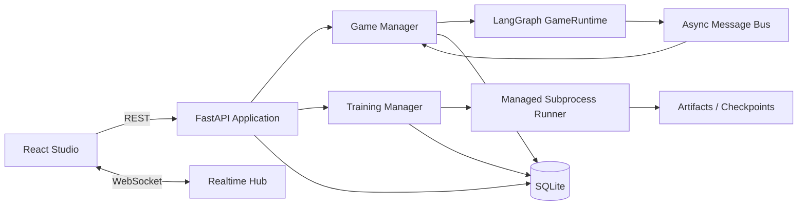

# WolfPlay Studio 产品设计

**日期：** 2026-08-13  
**状态：** 已确认，进入实现  
**产品定位：** 面向 AI Agent 研究、演示与训练运营的本地优先狼人杀博弈工作室，而不是单页观战 Demo。

## 1. 产品目标

WolfPlay Studio 将现有对战、Deep CFR、DPO 与多轮策略迭代能力统一成一个可部署、可追踪、可恢复的产品。用户应能在同一个界面中完成：配置 Agent、创建对局、实时观战、查看决策轨迹、回放历史、发起训练任务、检查产物与分析策略表现。

首个产品版本的完成标准不是“页面能打开”，而是以下闭环真实可用：

1. 创建一局七人狼人杀并持久化配置。
2. 通过 WebSocket 实时接收公开事件，不泄露存活阶段的私密身份信息。
3. 对局结束后查看全知回放、角色身份和认知决策轨迹。
4. 服务重启后仍能查询历史对局、事件和训练任务。
5. 从训练工作台创建自博弈、潜在策略聚类、Deep CFR、CFR-DPO、DPO 或迭代训练任务。
6. 实时查看任务日志、状态、产物路径，并可取消运行中的任务。
7. 在分析页面查看阵营胜率、平均轮数、角色存活率、策略使用和 Reflexion 指标。

## 2. 用户与核心场景

### 2.1 研究开发者

- 验证不同模型或提示策略的博弈表现。
- 查看每个 Agent 的 Planner 候选、Evaluator 评分和 Reflexion。
- 发起小规模训练或数据构建任务，检查产物链路是否完整。

### 2.2 演示与面试场景

- 在环形桌面实时展示多智能体交互。
- 用时间轴回放关键夜间行动、发言和投票。
- 展示训练体系、策略空间和可解释指标，而不是只展示终局胜负。

## 3. 信息架构

### 3.1 总览 Dashboard

- 当前运行对局、最近对局与训练任务。
- 阵营胜率、平均轮数、Reflexion 触发率、非法动作率。
- 快速创建对局与训练任务。

### 3.2 Arena 实时竞技场

- 环形七人桌、当前轮次与阶段、昼夜氛围切换。
- 玩家存活、发言状态、投票连线、淘汰与终局角色揭晓。
- 实时事件流、阶段进度、暂停跟随与自动滚动。
- 终局后打开决策检查器，查看候选策略和评分。

### 3.3 Replays 历史与回放

- 按状态、胜方、日期和种子筛选。
- 时间轴跳转、播放/暂停、倍速、逐事件步进。
- 公共视角与终局全知视角切换。

### 3.4 Agents Agent 管理

- 内置启发式 Agent 与 OpenAI-compatible Agent 配置。
- 模型名称、Endpoint、环境变量前缀、超时和温度配置。
- API Key 只从环境变量读取，数据库不持久化明文密钥。
- 按狼人阵营和村庄阵营分别选择 Agent。

### 3.5 Training 训练工作台

- 任务类型：自博弈、潜在策略构建、Deep CFR、CFR-DPO、DPO、迭代策略优化。
- 表单根据任务类型动态展示参数。
- 任务队列、实时日志、取消、失败原因、产物清单与断点续跑状态。

### 3.6 Analytics 数据分析

- 阵营胜率和趋势、平均轮数、终止原因分布。
- 角色存活率、发言策略分布、Reflexion 和非法动作统计。
- 对局级数据可下钻到回放和决策轨迹。

## 4. 视觉方向

采用“午夜剧场 + 战术控制台”视觉系统：

- 主色为近黑蓝、冷灰和月光白；狼人事件使用锈红，村庄事件使用青绿，系统事件使用琥珀。
- 标题使用具有戏剧张力的衬线字体，正文使用紧凑的人文无衬线字体，避免通用 SaaS 模板感。
- Arena 是产品视觉中心：环形布局、月相背景、阶段光晕、玩家席位和投票连线形成强记忆点。
- 数据密集页面保持清晰，不依赖大量卡片堆叠；使用分区、细线、刻度和控制台式状态语言。
- 动效服务于状态变化：阶段切换、发言聚焦、投票路径、角色揭晓和训练日志推进。
- 支持桌面、平板和窄屏；关键操作具备键盘焦点、语义标签和颜色之外的状态表达。

## 5. 技术架构

### 5.1 后端

- FastAPI 提供 REST、WebSocket、生命周期管理和生产静态资源托管。
- SQLAlchemy 2 异步 ORM + SQLite 保存对局、事件、Agent 配置和训练任务。
- `GameRuntime` 通过可选异步事件观察器连接 Web 层；默认 CLI 行为保持不变。
- `GameManager` 负责并发对局、状态持久化、事件过滤、取消与异常恢复。
- `TrainingManager` 使用受控子进程调用现有 CLI，逐行收集日志并更新任务状态。
- 生产部署由 FastAPI 托管 `web/dist`；开发环境由 Vite 代理 `/api` 和 `/ws`。

### 5.2 前端

- React + TypeScript + Vite。
- React Router 管理多页面路由。
- TanStack Query 管理 REST 缓存、刷新和错误状态。
- Recharts 展示统计图；Lucide 提供一致图标。
- 原生 WebSocket 客户端负责对局和训练实时流，包含重连与状态提示。

## 6. 数据模型

### 6.1 Game

- `id`、`seed`、`max_rounds`、`status`、`winner`、`termination_reason`。
- `current_round`、`current_phase`、`event_count`。
- `config_json`、`players_json`、`result_json`、`error`。
- `created_at`、`started_at`、`completed_at`。

### 6.2 GameEvent

- `game_id`、`logical_time`、`topic`、`round_no`、`phase`、`sender`。
- `payload_json`、`audience_json`、`is_public`、`created_at`。
- 公开事件可实时广播；私密事件仅持久化，并在终局全知视角读取。

### 6.3 AgentProfile

- `id`、`name`、`kind`、`model`、`base_url`、`env_prefix`。
- `temperature`、`timeout_seconds`、`enabled`、时间戳。
- 不保存 API Key。

### 6.4 TrainingJob

- `id`、`kind`、`status`、`stage`、`progress`。
- `config_json`、`command_json`、`metrics_json`。
- `output_path`、`log_path`、`pid`、`error`、时间戳。

## 7. API 与实时协议

### 7.1 REST

- `GET /api/health`
- `GET/POST /api/games`
- `GET /api/games/{id}`
- `GET /api/games/{id}/events?view=public|omniscient`
- `POST /api/games/{id}/cancel`
- `GET/POST/PATCH/DELETE /api/agents`
- `GET /api/training/jobs`
- `POST /api/training/jobs`
- `GET /api/training/jobs/{id}`
- `GET /api/training/jobs/{id}/logs`
- `POST /api/training/jobs/{id}/cancel`
- `GET /api/analytics/overview`
- `GET /api/analytics/timeseries`

### 7.2 WebSocket

- `/ws/games/{id}`：发送 snapshot、event、status、error、heartbeat。
- `/ws/training/{id}`：发送 snapshot、log、status、artifact、heartbeat。
- 客户端连接后先收到当前快照，再接收增量消息；断线后通过 REST 快照恢复。

## 8. 隐私与安全边界

- 进行中的对局只通过实时接口暴露公开事件。
- `role_assignment`、`werewolf_team`、`werewolf_proposal` 和 `seer_result` 不进入公开流。
- 终局后才允许 `omniscient` 事件视图和完整角色揭晓。
- API Key 只从服务进程环境变量读取，Agent 配置只保存环境变量前缀。
- 训练命令由白名单构建，不接受前端传入任意 shell 字符串。
- 所有路径限制在配置的 artifacts 根目录内。

## 9. 错误处理与恢复

- 后端启动时将遗留 `running` 对局和训练任务标记为 `interrupted`，避免假运行状态。
- 对局异常写入数据库并向 WebSocket 广播可读错误，不丢失已产生事件。
- 训练子进程退出码非零时保存最后日志和错误；用户可基于原配置重新创建任务。
- 前端统一显示离线、重连、空数据、权限限制和失败状态，不使用静默失败。
- SQLite 使用 WAL 模式和外键约束，写操作通过短事务完成。

## 10. 验收标准

### 功能

- 可创建两局并发启发式对局，事件分别实时更新且不串流。
- 对局结束后刷新浏览器，历史、角色、事件和决策轨迹仍完整。
- 进行中通过公共接口无法读取私密事件；终局全知视角可以读取。
- 可创建并完成一个小规模自博弈训练任务，日志和产物可查询。
- 取消长任务后数据库、进程和界面状态一致。

### 工程

- 现有 Python 测试保持通过，并新增 API、持久化、WebSocket 和任务管理测试。
- Ruff、Python 测试、前端类型检查、前端单测和生产构建通过。
- 浏览器端完成创建对局、实时观战、终局揭晓、历史回放和训练任务的端到端验收。
- README 提供开发、生产、数据库和前端命令，不依赖隐含步骤。

